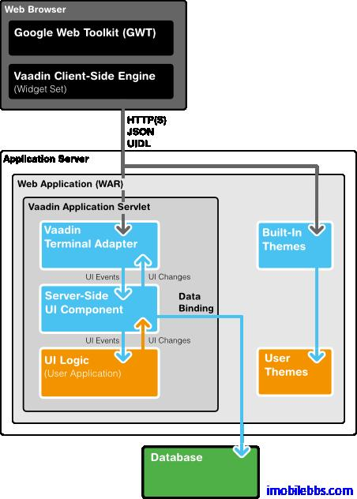

# Vaadin 應用程序框架介紹

Vaadin 應用程序框架為一伺服器端技術，允許開發人員採用和開發桌面應用類似的方法開發 Web 應用。儘管 Vaadin 底層採用了 HTML，JavaScript，AJAX 等 Web 技術，Vaadin 應用程序框架很好的隱藏了這些細節，開發人員一般無需了解上述 Web 技術來開發 Vaadin 應用。

下圖為 Vaadin 總體結構圖：

Vaadin 包含了一組 Web 應用開發的 API，大量的 UI 組件，多種內置主題，以及數據綁定允許將數據源直接綁定到 UI 組件。

一個 Vaadin 應用實際為運行在 Java Web 伺服器上的 Serverlet，Vaadin 的 Terminal Adapter 接受來自客戶端瀏覽器發來的請求並解釋用戶事件(Event),Event 由 UI 組件發送給應用，應用通過 Listener 來響應用戶事件。這和桌面應用非常類似。 如果應用程序需要修改 UI 顯示，這是通過 Terminal Adapter 向瀏覽器發迴響應（Response）來實現的。

所以 Vaadin 應用都由 com.vaadin.Application 派生。應用創建用戶界面，響應用戶事件等。

Vaadin 應用程序框架的幾個主要組成部分如下：

## 用戶界面組件( User Interface Components)

包括界面布局（Layout），UI 控制項（如 Button，Link，Lable 等），和 Swing 提供的 UI 組件類似。Vaadin 的 UI 組件由兩部分組成：Client-Side 和 Server-Side。每個客戶端部分對應一個伺服器部分。他們之間通信通過 Terminal Adapter 來完成。

## 客戶端引擎(Client-side Engine)

Vaadin 的客戶端引擎使用 GWT（Google Web Toolkit）來渲染顯示 UI 組件，它通過 Terminal Aapater 與伺服器端UI組件部分通信。UI 變化使用 UIDL（User Interface Definition Language）語言來描述。UIDL 基於 JSON 表述。

## 終端適配器 (Terminal Adapter)

Vaadin 的 UI 組件不直接顯示在網頁上，而是通過終端適配器。有了這個額外的抽象層使得 Vaadin 應用可以運行於大部分的瀏覽器上。最新的 Vaadin 應用使用 GWT 來顯示 UI 控制項。UI 組件向Terminal Adapter 報告界面變化，當用戶觸發某個事件（比如點擊按鈕），這個事件由 Client-Side Engine 以 AJAX 請求的方法報告給伺服器端的 Terminal Adapter。服務端處理事件後再通過Terminal Adapter 以 Response 的方式返回給 Client-Side Engine，從而進一步修改 UI 顯示。

## 顯示主題(Theme)

Vaadin 將UI 顯示的表述(Presentation)和邏輯(Logic)分開. 其中 UI 邏輯由對應的 Java 代碼處理。而採用主題通過 CSS 來定義 UI 顯示。Vaadin 內置多種顯示主題，開發人員也可自定義主題。

## 用戶界面定義語言（UIDL）

Terminal Adapter 使用 UIDL 來描述 UI 控制項及其變化。UIDL 本身通過 JSON 來描述。所有的 UI 變化，如 Check 按鈕選擇與否的狀態都是通過 UIDL 來描述的。

## 事件(Events)

用戶交互觸發事件，如滑鼠按鍵，事件首先由 Client-Side Engine 處理，然後以 HTTP 請求的方式發送多到伺服器，Terminal Adapter， 伺服器端 UI 組件部分等。

## 數據模型(Data Model)

Vaadin 定義了數據模型，使用這種數據模型，UI 組件可以綁定到數據源，比如變數，數組，資料庫的表。

Tags: [Java EE](http://www.imobilebbs.com/wordpress/archives/tag/java-ee), [Vaadin](http://www.imobilebbs.com/wordpress/archives/tag/vaadin), [Web](http://www.imobilebbs.com/wordpress/archives/tag/web)
