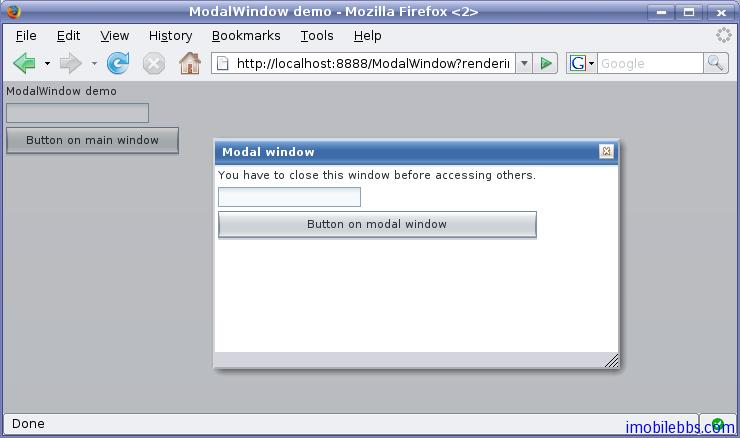

# Vaadin Web 應用的基本組成部分

上篇博客 [Vaadin Web 應用開發教程(4):開始編寫 Web 應用](http://www.imobilebbs.com/wordpress/?p=3152) 介紹了一個最簡單的 Vaadin 應用。一般來說，一個 Vaadin 應用由下面幾個部分構成：

- Windows  每個 Web 應用都有一個主窗口。主窗口(Main windows) 為應用程序級窗口，或是指 UI層次的根元素。實際上 Web 應用可以包含多個應用程序級(application level)窗口,這些窗口都和Application 對象關聯。 每個根窗口還可以包含多個子窗口。
- UI 組件 ，每個應用的用戶界面都由這些UI組件組合而成，用戶通過這些 UI 組件和應用程序交互，用戶通過 UI 組件觸發事件，Web 應用通過事件處理函數來響應用戶。大部分的 UI 組件支持數據綁定。這些 UI 組件包括 Label,Button，Checkbox 等，程序員可以通過繼承或組合來定義用戶界面。
- Events 和 Listener  Event 為事件，Listener 用來處理事件。
- 資源 應用程序可以在頁面上顯示圖像，超鏈接等，這些為資源文件，Vaadin 支持多種資源種類。
- 顯示主題 Vaadin 將 UI 顯示的表述(Presentation)和邏輯(Logic)分開. 其中 UI 邏輯由對應的 Java 代碼處理。而採用主題通過 CSS 來定義 UI 顯示。Vaadin 內置多種顯示主題，開發人員也可自定義主題。
- 數據綁定 Vaadin 定義了數據模型，使用這種數據模型，UI 組件可以綁定到數據源，比如變數，數組，資料庫的表。
- 
## 主窗口

一般來說一個 Vaadin Web 應用只有一個主窗口(Main Windows)。 一般在 Application 對象中通過 setMainWindow() 設置主窗口。

```
import com.vaadin.ui.*;

public class HelloWorld extends com.vaadin.Application {
    public void init() {
        Window main = new Window("The Main Window");
        setMainWindow(main);

        ... fill the main window with components ...     }}
```

定義了主窗口之後，可以通過主窗口的 addComponent 為主窗口添加其它 UI 組件。這些 UI 組件將使用主窗口的預設布局來排列 UI 組件，如果你需要使用其它布局方法，可以通過 setContent()定義新的布局。

## 子窗口

Vaadin 的窗口有兩種類型，一種為應用程序級(Application level)的窗口，如上面的主窗口，另外一種為子窗口，顯示在某個應用程序級的窗口中。

子窗口的創建和關閉，子窗口也是 Window 對象，通過 addWindow 添加到主窗口中，關閉子窗口是通過 Application 對象的 removeWindow() 方法。

```
//open a window
mywindow = new Window("My Window");
mainwindow.addWindow(mywindow);
...
//close a window
myapplication.removeWindow (mywindow);
```

子窗口預設可以通過右上方的關閉按鈕關閉，可以通過將子窗口設為 readonly 禁止用戶提供關閉按鈕關閉子窗口。

可以通過 setHeight, setWidth ,setPositionX,setPositionY 來設置窗口的大小和在屏幕的位置。

```
/* Create a new window. */
mywindow = new Window("My Dialog");
/* Set window size. */
mywindow.setHeight("200px");
mywindow.setWidth("400px");
/* Set window position. */
mywindow.setPositionX(200);
mywindow.setPositionY(50);
```

如果子窗口的大小為固定或者通過比例定義，當它顯示的內容過大時，會自動出現滾動條。但如果子窗口某方向大小為定義時，則其大小會自動適應需顯示的內容而不會出現滾動條。

Vaadin 的窗口也支持所謂模式窗口，通常對話框顯示為模式窗口。下圖為一模式窗口，其父窗口為灰色顯示：



## 事件處理

Vaadin 事件處理也是通過為UI組件添加 Listener 的方法來實現的，使用 Listener 有三種基本用法，下面以一個 Button 為例來說明這幾種基本用法。

這裡定義一個事件處理類來處理 Button 的 Click 事件

```
public class TheButton implements Button.ClickListener {
    Button thebutton;

    /** Creates button into given container. */
    public TheButton(AbstractComponentContainer container) {
        thebutton = new Button ("Do not push this button");
        thebutton.addListener(this);
        container.addComponent(thebutton);
    }

    /** Handle button click events from the button. */
    public void buttonClick (Button.ClickEvent event) {
        thebutton.setCaption ("Do not push this button again");
    }
}
```

一個應用中通常需要處理來自同一個類的多個UI對象觸發的事件，比如多個 Button，此時在 Listener中需要區分事件是由哪個 Button 觸發的。Vaadin 支持多種方法來解決這個問題。一是通過 event 的getButton 方法，如下：

```
public class TheButtons implements Button.ClickListener {
    Button thebutton;
    Button secondbutton;

    /** Creates two buttons in given container. */
    public TheButtons(AbstractComponentContainer container) {
        thebutton = new Button ("Do not push this button");
        thebutton.addListener(this);
        container.addComponent(thebutton);

        secondbutton = new Button ("I am a button too");
        secondbutton.addListener(this);
        container.addComponent (secondbutton);
    }

    /** Handle button click events from the two buttons. */
    public void buttonClick (Button.ClickEvent event) {
        if (event.getButton() == thebutton)
            thebutton.setCaption("Do not push this button again");
        else if (event.getButton() == secondbutton)
            secondbutton.setCaption("I am not a number");
    }
}
```

第二種方法是使用 addListener 的另外一個重載方法，這個方法可以將事件處理方法做為參數。如下例，參數類型為字元串，為事件處理函數的名稱。

```
public class TheButtons2 {
    Button thebutton;
    Button secondbutton;

    /** Creates two buttons in given container. */
    public TheButtons2(AbstractComponentContainer container) {
        thebutton = new Button ("Do not push this button");
        thebutton.addListener(Button.ClickEvent.class, this,
                              "theButtonClick");
        container.addComponent(thebutton);

        secondbutton = new Button ("I am a button too");
        secondbutton.addListener(Button.ClickEvent.class, this,
                                 "secondButtonClick");
        container.addComponent (secondbutton);
    }

    public void theButtonClick (Button.ClickEvent event) {
        thebutton.setCaption ("Do not push this button again");
    }

    public void secondButtonClick (Button.ClickEvent event) {
        secondbutton.setCaption ("I am not a number!");
    }
}
```

第三種方法為匿名函數方法，這也是最簡單的一種方法，無需定義新的類來處理事件。如下：

```
public class TheButtons3 {
    Button thebutton;
    Button secondbutton;

    /** Creates two buttons in given container. */
    public TheButtons3(AbstractComponentContainer container) {
        thebutton = new Button ("Do not push this button");

        /* Define a listener in an anonymous class. */
        thebutton.addListener(new Button.ClickListener() {
            /* Handle the click. */
            public void buttonClick(ClickEvent event) {
                thebutton.setCaption (
                        "Do not push this button again");
            }
        });
        container.addComponent(thebutton);

        secondbutton = new Button ("I am a button too");
        secondbutton.addListener(new Button.ClickListener() {
            public void buttonClick(ClickEvent event) {
                secondbutton.setCaption ("I am not a number!");
            }
        });
        container.addComponent (secondbutton);
    }
}
```

事件通常由系統觸發，但也可以通過方法 fireEvent 來觸發某個事件。

Tags: [Java EE](http://www.imobilebbs.com/wordpress/archives/tag/java-ee), [Vaadin](http://www.imobilebbs.com/wordpress/archives/tag/vaadin), [Web](http://www.imobilebbs.com/wordpress/archives/tag/web)