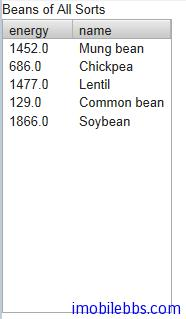
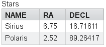

# 使用 Container 介面管理一組 Item

單個屬性使用 Property 介面，一組 Property 使用 Item 介面來管理，Container 介面則管理一組具有相同屬性的 Item。Container 所包含的 Item 使用 Item 標識符（IID）來區分。
Item 通過方法 addItem()方法向 Container 添加 Item。 查詢某個屬性可以先通過 getItem()取得 Item 對象，然後再使用 getItemProperty()方法，或者直接使用 getContainerProperty 方法來讀取。
Vaadin 在設計 Container 介面考慮到靈活性和高效性，它包括了一些可選的介面一支持內部 Item 的排序，索引或者以層次關係來訪問 Item，從而為實現 Table,Tree,Select 等 UI 組件提供了實現基礎。
和其它數據模型類似，Container 介面也提供了數據變動事件的支持。
Container 可以是無序的，有序的，帶索引或是支持層次關係，因此可以支持幾乎現實中所有數據模型。Vaadin 內部實現支持一些常用的數據源，比如簡單的二維表（IndexedContainer)和文件系統(FileSystemContainer)等。
除了上面通用的 Container實現，一些 UI 組件本身就實現了 Container介面，比如 Select 組件。
## 使用 BeanContainer

BeanContainer 為使用內存來管理 JavaBean 對象的 Container 類型。每個其中的 Item 為使用BeanItem 封裝的 Java 對象。Item 的屬性會根據 setter, getter 自動識別，因此需要使用的Java Bean 具有 public 修飾符。也只有同類型的 Java Bean 對象才可以添加到 BeanContainer中。

BeanContainer 為一 generic 類型，使用時給出所包含的 Bean 類型和 Item 標識符的類型。參考下面例子：

```
// Here is a JavaBean
public class Bean implements Serializable {
    String name;
    double energy; // Energy content in kJ/100g
    
    public Bean(String name, double energy) {
        this.name   = name;
        this.energy = energy;
    }
    
    public String getName() {
        return name;
    }
    
    public void setName(String name) {
        this.name = name;
    }
    
    public double getEnergy() {
        return energy;
    }
    
    public void setEnergy(double energy) {
        this.energy = energy;
    }
}

void basic(VerticalLayout layout) {
    // Create a container for such beans with
    // strings as item IDs.
    BeanContainer<String, Bean> beans =
        new BeanContainer<String, Bean>(Bean.class);
    
    // Use the name property as the item ID of the bean
    beans.setBeanIdProperty("name");

    // Add some beans to it
    beans.addBean(new Bean("Mung bean",   1452.0));
    beans.addBean(new Bean("Chickpea",    686.0));
    beans.addBean(new Bean("Lentil",      1477.0));
    beans.addBean(new Bean("Common bean", 129.0));
    beans.addBean(new Bean("Soybean",     1866.0));

    // Bind a table to it
    Table table = new Table("Beans of All Sorts", beans);
    layout.addComponent(table);
}
```



## 嵌套屬性
如果 Java Bean 有個嵌套的 Java Bean 類型，而且具有和這個嵌套 Java Bean 具有1對1的關係，你可以將這個嵌套類的屬性添加到 Container 中，就如同直接包含在其中 Java Bean 的屬性一樣。同樣此時嵌套的 Java Bean 也必須具有 public 修飾符。
如下例：
先定義兩個 Java Bean 類型，其中 EqCoord 作為 Star 的嵌套類，一個 Star 類對應一個EqCoord，一一對應的關係。

```
/** Bean to be nested */
public class EqCoord implements Serializable {
    double rightAscension; /* In angle hours */
    double declination;    /* In degrees     */

    ... constructor and setters and getters for the properties ...
}

/** Bean containing a nested bean */
public class Star implements Serializable {
    String  name;
    EqCoord equatorial; /* Nested bean */

    ... constructor and setters and getters for the properties ...
}
```

在創建好 Container 之後，可以通過方法 addNestedContainerProperty 將嵌套類的屬性添加到Container 中。

```
// Create a container for beans
final BeanItemContainer<Star> stars =
    new BeanItemContainer<Star>(Star.class);
 
// Declare the nested properties to be used in the container
stars.addNestedContainerProperty("equatorial.rightAscension");
stars.addNestedContainerProperty("equatorial.declination");
 
// Add some items
stars.addBean(new Star("Sirius",  new EqCoord(6.75, 16.71611)));
stars.addBean(new Star("Polaris", new EqCoord(2.52, 89.26417)));
```

如果將這個 Container 綁定到一個 TableUI 組件，你可能需要為表的列定義列名稱。嵌套類的屬性也作為單獨的列顯示在表格中，如果需要隱藏某個列，可以通過方法 setVisibleColumns 修改例的可見性。

```
// Put them in a table
Table table = new Table("Stars", stars);
table.setColumnHeader("equatorial.rightAscension", "RA");
table.setColumnHeader("equatorial.declination",    "Decl");
table.setPageLength(table.size());

// Have to set explicitly to hide the "equatorial" property
table.setVisibleColumns(new Object[]{"name",
    "equatorial.rightAscension", "equatorial.declination"});
```



## 使用 BeanItemContainer
BeanItemContainer 用來管理一組由 BeanItem 封裝的 Java Bean 對象。Item 的屬性會根據setter, getter 自動識別，因此需要使用的 Java Bean 具有 public 修飾符。也只有同類型的Java Bean 對象才可以添加到 BeanItemContainer 中。
BeanItemContainer 為 BeanContainer 的一個特別版本，它不需要指明 Item 標識符的類型，而直接使用 Item 對象來區分 Item。因此比 BeanContainer 使用更簡單。

```
// Create a container for the beans
BeanItemContainer<Bean> beans =
    new BeanItemContainer<Bean>(Bean.class);
    
// Add some beans to it
beans.addBean(new Bean("Mung bean",   1452.0));
beans.addBean(new Bean("Chickpea",    686.0));
beans.addBean(new Bean("Lentil",      1477.0));
beans.addBean(new Bean("Common bean", 129.0));
beans.addBean(new Bean("Soybean",     1866.0));
 
// Bind a table to it
Table table = new Table("Beans of All Sorts", beans);
```

## 遍歷 Container
Container 所包含的 Item 對象並不一定需要排過序，遍歷整個 Container 可以通過 Iterator 介面。Container 的 getItemIds()返回一個 Collection 集合支持枚舉。下例為遍歷一個 Table，檢查其中為 Checkbox 的某個列，選擇出所有選中的 Item。

```
// Collect the results of the iteration into this string.
String items = "";

// Iterate over the item identifiers of the table.
for (Iterator i = table.getItemIds().iterator(); i.hasNext();) {
    // Get the current item identifier, which is an integer.
    int iid = (Integer) i.next();
    
    // Now get the actual item from the table.
    Item item = table.getItem(iid);
    
    // And now we can get to the actual checkbox object.
    Button button = (Button)
            (item.getItemProperty("ismember").getValue());
    
    // If the checkbox is selected.
    if ((Boolean)button.getValue() == true) {
        // Do something with the selected item; collect the
        // first names in a string.
        items += item.getItemProperty("First Name")
                     .getValue() + " ";
    }
}
 
// Do something with the results; display the selected items.
layout.addComponent (new Label("Selected items: " + items));
```

## 過濾 Container
對應 Container 的 Item 對象，可以定義一些查詢條件來過濾掉一些 Item。如同數據查詢時使用WHERE 語句來查詢表格。比如下面代碼定義一個簡單的過濾器來匹配 name 列以 Douglas 開頭的 Item

```
Filter filter = new SimpleStringFilter("name",
        "Douglas", true, false);
table.addContainerFilter(filter);
```

Filter 可以為單個（atomic)或是組合(Composite)類型。單個 Filter 定義單獨的一個條件，如上面的 SimpleStringFilter,組合的 Filter 有多個單個的 Filter 通過 NOT,OR,AND 組合而成。例如：

```
filter = new Or(new SimpleStringFilter("name",
        "Douglas", true, false),
        new Compare.Less("age", 42));
```

Vaadin 定義了常用的 Filter 類型，如 SimpleStringFilter，IsNull，Equal, Greater, Less, GreaterOrEqual, LessOrEqual,And, Or 和 Not 等，也可以自定義一個 Filter 類型，如：

```
class MyCustomFilter implements Container.Filter {
    protected String propertyId;
    protected String regex;
    
    public MyCustomFilter(String propertyId, String regex) {
        this.propertyId = propertyId;
        this.regex      = regex;
    }

    /** Tells if this filter works on the given property. */
    @Override
    public boolean appliesToProperty(Object propertyId) {
        return propertyId != null &&
               propertyId.equals(this.propertyId);
    }
```

Tags: [Java EE](http://www.imobilebbs.com/wordpress/archives/tag/java-ee), [Vaadin](http://www.imobilebbs.com/wordpress/archives/tag/vaadin), [Web](http://www.imobilebbs.com/wordpress/archives/tag/web)