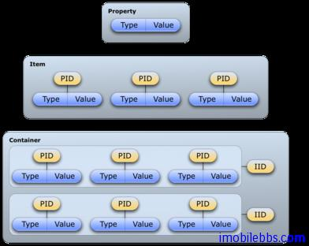
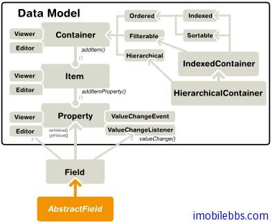

# 数据绑定-概述

本篇介绍 Vaadin 的数据模型及数据绑定-将数据源绑定到 UI 组件。
Vaadin 通过数据绑定可以支持用户提供 UI 组件（界面）直接操作数据模型（显示或者直接修改）。
Vaadin 的数据模型分为三个层次： Property, Item 和 Container. 类比 Excel 电子表格，可以分别类比电子表格的单元格，一行和整个表单。

Vaadin 数据某些相关的接口和类定义在包 com.vaadin.data 中。要注意的是 Vaadin 定义的数据模型都是通过接口来定义的，而非实类。这也体现了“编程到接口”的设计模式，因此支持数据绑定的数据源可以多种多样，比如普通 Java 类， 文件系统，数据库等。

Vaadin 的 UI 组件和数据绑定关系密切。 所有实现了 Field 接口的 UI 组件都支持数据绑定。这些UI 组件也可以称为 Field 组件。与其绑定的值可以通过 Property 属性来访问。
下图显示了 Vaadin 数据模型接口之间的关系：

Vaadin 的数据模型支持多种功能，比如支持数据更新通知，支持索引，排序，过滤等。
Vaadin 通过了多种内置的数据模型如 SQL 数据库支持等，也可以通过插件的方式支持其它数据类型，如 JPA 支持。

Tags: [Java EE](http://www.imobilebbs.com/wordpress/archives/tag/java-ee), [Vaadin](http://www.imobilebbs.com/wordpress/archives/tag/vaadin), [Web](http://www.imobilebbs.com/wordpress/archives/tag/web)