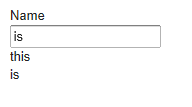

# 数据绑定-Property 接口

[Property 接口](https://vaadin.com/api/com/vaadin/data/Property.html)为 Vaadin 数据模型的基本接口，它提供了读写单个数据对象的标准 API。 一个 Property 对象总是有数据类型的，尽管它支持可选的数据类型转换。Property 的数据可以为任意的 Java 对象，Property 也提供了监听数据变化的事件消息。
Property 的读写方法为 getValue()和 setValue() 。getValue() 返回通用的 Object 类型的对象，因此可以强制转换成所需的数据类型。Property 的类型可以通过 getType()取得。
Property 值发生变化说触发 ValueChangeEvent 事件，可以通过 ValueChangeListener 监听这个事件。

```
final TextField tf = new TextField("Name");
        
// Set the value
tf.setValue("The text field value");
        
// When the field value is edited by the user
tf.addListener(new Property.ValueChangeListener() {
    public void valueChange(ValueChangeEvent event) {
        // Get the value and cast it to proper type
        String value = (String) tf.getValue();
        
        // Do something with it
        layout.addComponent(new Label(value));
    }
});
```



使用 Property 接口，一是实现 Property 接口，而是使用 Vaadin 内置的两个 Property 接口实现：MethodProperty 主要用于 Java Bean，而是 ObjectProperty 用于简单的 Java 对象。

与 Property 接口关系紧密的还有两个接口[Property.Editor](https://vaadin.com/api/com/vaadin/data/Property.Editor.html)和 [Property.Viewer](https://vaadin.com/api/com/vaadin/data/Property.Viewer.html)可以用来显示和编译 Property 值，大部分的 UI 组件，尤其是 Field 组件实现了这两个接口，因此 Field 组件可以直接绑定到 Property 对象，用来显示或编辑 Property 数据。

下例使用 Label 来显示一个 [ObjectProperty](https://vaadin.com/api/com/vaadin/data/util/ObjectProperty.html) 对象

```
// Have a data model
ObjectProperty property =
    new ObjectProperty("Hello", String.class);
        
// Have a component that implements Viewer
Label viewer = new Label();
        
// Bind it to the data
viewer.setPropertyDataSource(property);
```

同样可以使用一个 TextField 来编辑并显示一个 ObjectProperty 对象

```
// Have a data model
ObjectProperty property =
    new ObjectProperty("Hello", String.class);
        
// Have a component that implements Viewer
TextField editor = new TextField("Edit Greeting");
        
// Bind it to the data
editor.setPropertyDataSource(property);
```


前面说过所有 Field 组件也实现了 Property 接口，因此也可以把 Field 组件绑定到实现了Property.Viewer 接口的 UI 组件，如 Label。下例把一个 Label 绑定到一个 TextField，因此Label 显示的内容会和 TextField 的值变化而变化。

```
Label viewer = new Label();
viewer.setPropertyDataSource(editor);
 
// The value shown in the viewer is updated immediately
// after editing the value in the editor (once it
// loses the focus)
editor.setImmediate(true);
```

此外，你也可以自行实现 Property 接口，然后绑定到 Field 组件。

```
class MyProperty implements Property {
    Integer data     = 0;
    boolean readOnly = false;
    
    // Return the data type of the model
    public Class<?> getType() {
        return Integer.class;
    }

    public Object getValue() {
        return data;
    }
    
    // Override the default implementation in Object
    @Override
    public String toString() {
        return Integer.toHexString(data);
    }

    public boolean isReadOnly() {
        return readOnly;
    }

    public void setReadOnly(boolean newStatus) {
        readOnly = newStatus;
    }

    public void setValue(Object newValue)
            throws ReadOnlyException, ConversionException {
        if (readOnly)
            throw new ReadOnlyException();
            
        // Already the same type as the internal representation
        if (newValue instanceof Integer)
            data = (Integer) newValue;
        
        // Conversion from a string is required
        else if (newValue instanceof String)
            try {
                data = Integer.parseInt((String) newValue, 16);
            } catch (NumberFormatException e) {
                throw new ConversionException();
            }
        else
             // Don't know how to convert any other types
            throw new ConversionException();

        // Reverse decode the hexadecimal value
    }
}
        
// Instantiate the property and set its data
MyProperty property = new MyProperty();
property.setValue(42);
        
// Bind it to a component
final TextField tf = new TextField("Name", property);
```

Tags: [Java EE](http://www.imobilebbs.com/wordpress/archives/tag/java-ee), [Vaadin](http://www.imobilebbs.com/wordpress/archives/tag/vaadin), [Web](http://www.imobilebbs.com/wordpress/archives/tag/web)

