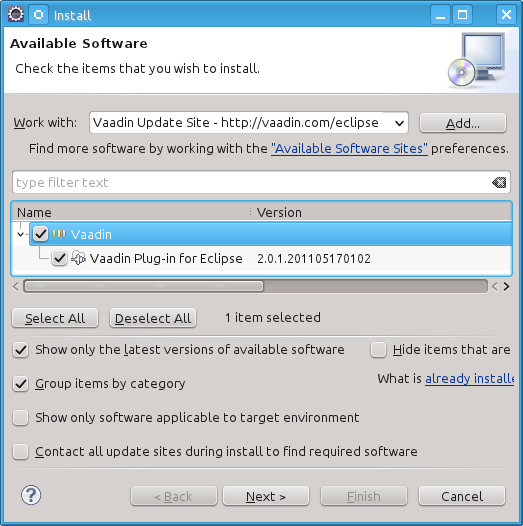
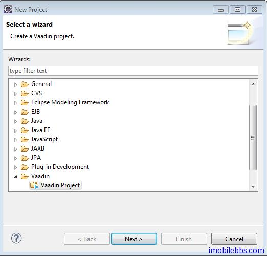
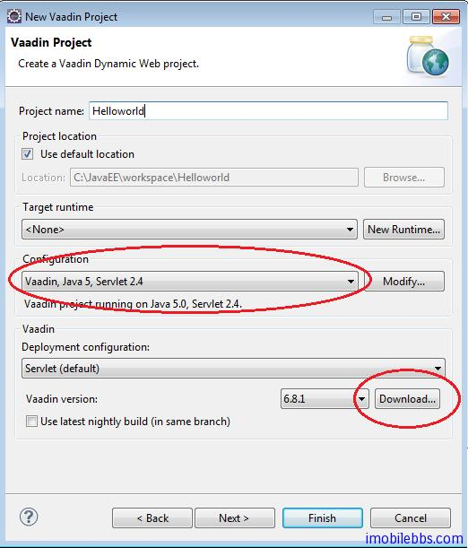
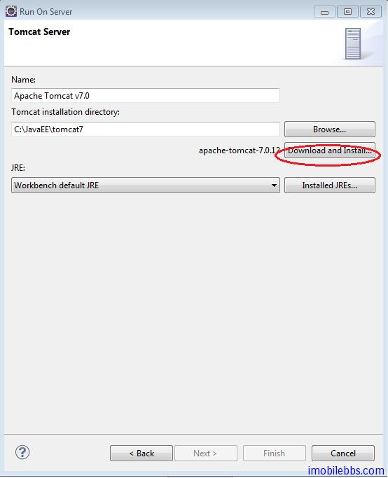
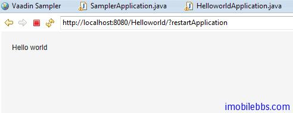

# 安裝開發環境

Vaddin 支持多種開發環境，如 Eclipse，NetBean 等，這裡使用 Eclipse 開發環境，也是最常用的Vaddin 開發環境。 這裡假定你對開發 Java 程序有一定的了解，對 Eclipse 開發也比較熟悉。如果你在做 Android 開發，希望開發一些 Client/Server 的 Android 應用，Vaddin 是一個比較好的選擇，Vaddin 使用純 Java 開發環境，也使用 EclipseIDE，可以用來開發伺服器端應用。

Vaddin 開發環境使用如下工具：

- [Windows](http://www.microsoft.com/windowsxp/), Linux, or Mac OS X
- [Sun Java 2 Standard Edition 6.0](http://java.sun.com/javase/downloads/index.jsp)(Java 1.5 or newer is required)
- [Eclipse IDE for Java EE Developers](http://www.eclipse.org/downloads/)
- [Apache Tomcat 7.0 (Core) or newer](http://tomcat.apache.org/)
- [Mozilla Firefox](http://www.getfirefox.com/) browser
- [Firebug](http://www.getfirebug.com/) debug tool (optional)
- [Vaadin Framework](http://vaadin.com/download/)

1. 安裝 Eclipse Java EE 版  http://www.eclipse.org/downloads/packages/eclipse-ide-java-ee-developers/junor

2. 安裝 Vaadin 插件

啟動 Eclipse.
選擇菜單 Help → Software                    Updates….
選擇 the Available Software tab.
添加 Vaadin 插件 URL http://vaadin.com/eclipse


選擇 Vaadin 插件，然後安裝.



下面來創建一個 Hello World 項目，如果你的項目能正確運行，說明你安裝好 Vaadin 開發環境。

1.  創建新 Project  -> Vaadin -> Vaadin Project



項目名稱:Helloworld,  其它使用預設值，Vaadin 當前版本為 6.8.1 , 如果你沒有下載，可以選擇Download ，自動下載到本地。



點擊「Finish」，完成新項目的創建。

2.  運行 這個項目，在項目瀏覽器中選擇 Helloworld, 點擊右鍵，選擇 Run As ->Run on Server,

如果你第一次運行 Vaadin 項目，可能需要創建一個伺服器實例，提供選擇 Manually define a new server ,如果你希望使用 Tomcat 作為伺服器測試環境，可以選擇”Download additional server adapters” 然後選擇下載 Apache Geronimo V3.0 server.  然後選擇你要使用的 Tomcat 版本，最新的版本為 Tomcat 7. 你可以使用”Download and Install” 自動下載 Tomcat 到本地：



3. 修改 HelloworldApplication.java 代碼如下：

```
public class HelloworldApplication extends Application {
@Override
public void init() {
Window mainWindow = new Window(“Helloworld Application”);
Label label = new Label(“Hello world“);
mainWindow.addComponent(label);
setMainWindow(mainWindow);
}

}
```

如果你可以得到如下結果，就表示你 Vaadin 環境安裝成功：



註： 你可能需要在 url 後面加上?restartApplication 通知 Vaddin /Tomcat 使用新編譯的代碼。

後面將逐步詳細介紹 Vaadin 開發。

Tags: [Java EE](http://www.imobilebbs.com/wordpress/archives/tag/java-ee), [Vaadin](http://www.imobilebbs.com/wordpress/archives/tag/vaadin), [Web](http://www.imobilebbs.com/wordpress/archives/tag/web)
