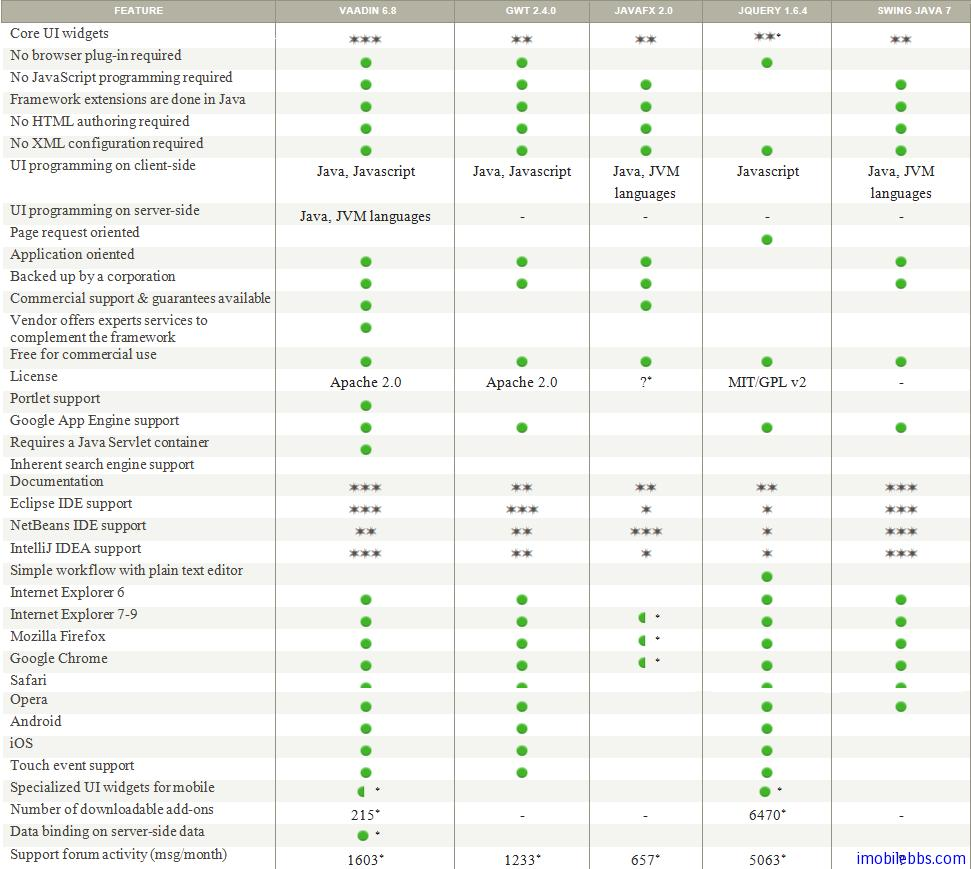
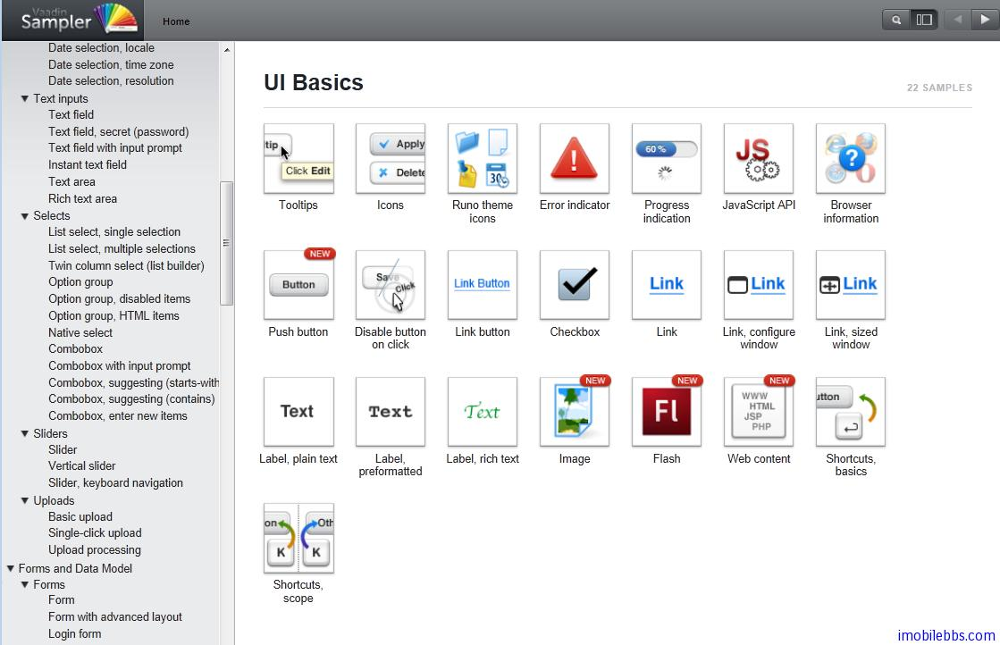

# 概述

Vaddin 是一个 Web 应用程序框架，用其开发的浏览器应用界面可以达到和桌面应用类似的效果，但和Flash，Silverlight 不同的是，Vaddin 应用无需再浏览器上安装任何插件。它是一个纯 Java 开发环境，开发人员无需深入了解 HTML，XML 或是 Javascipt。如果你曾经使用 Java 开发过 Swing，SWT 等应用，可以非常容易开始使用 Vaddin 开发 Web 应用。

下表为 Vaddin 应用程序框架和其它一些应用程序框架的比较：

Vaddin 应用程序框架具有如下特点：

- Comprehensive Component Framework
提供大量的 UI 控件，支持托放，支持移动设备（触摸事件），数据绑定 MVC，支持代码或 HTML 定义界面。支持自定义控件等。

- Web Compatibility
Vaddin UI 控件基于 GWT，因此具有很好的浏览器兼容性，无需安装浏览器插件。支持分页，回退按键，支持 URL 参数等。

- Customizable Look and Feel
很好的 CSS 支持，多种内置 Theme 和 Style，并可以自定义主题和风格。

- Java Web Development
纯 Java 开发环境，强大的服务器端技术开发模式，部署只需单个 Jar 文件，兼容多种 Java 虚拟机。

- Secure Web Application Architecture
服务器端状态管理，应用程序代码运行在服务器端，内置输入校验，安全请求检测等。

- Extensible Component Architecture
支持 GWT 扩展，提供多种插件以满足应用程序开发需求。

- Tools
支持多种开发环境如 Eclipse, Netbean, Maven 并提供 Vaadin TestBench 测试框架。

- Deployment
支持 JSR154 Java EE Sevlet 2.3+ 部署框架。 支持 JSR 168，JSR286 Portlet 部署。支持Google App Engine 部署。

最后看看 Vaadin 提供的 Sampler 的界面。[在线演示](http://demo.vaadin.com/sampler)

部分截图如下：

Tags: [Java EE](http://www.imobilebbs.com/wordpress/archives/tag/java-ee), [Vaadin](http://www.imobilebbs.com/wordpress/archives/tag/vaadin), [Web](http://www.imobilebbs.com/wordpress/archives/tag/web)

