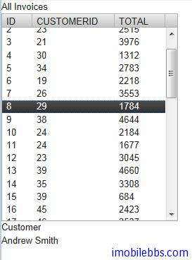

# SQLContainer-引用其它 SQLContainer

数据库表之间存在参考关键，这对应到数据库通常为外键引用。Vaadin 的 SQLContainer 提供了不同SQLContainer 之间引用的有限支持，但其实现主要是通过 Java 代码来实现的，并不需要数据库的表之间一定要有外键定义。
给一个 SQLContainer 添加引用的方法为：

```
public void addReference(SQLContainer refdCont,     
                         String refingCol, String refdCol);  
```
    
refdCont 为被引用的 SQLContainer，refingCol 为源 SQLContainer 对应的列名，refdCol 为目标 SQLContainer 被参照的列名。
要注意的是 SQLContainer 不支持同一个 SQLContainer 参照自身。

还是以 Customer ,Invoice 为例。 显示所有 Invoice，但点击某个 Invoice，显示对应的Customer 的姓名。

```
void openTable(VerticalLayout layout){
	try {
		JDBCConnectionPool pool = new SimpleJDBCConnectionPool(
				"org.hsqldb.jdbc.JDBCDriver",
				"jdbc:hsqldb:file:/hsqldb/data/sample", "SA", "", 2, 5);
		TableQuery customers = new TableQuery("CUSTOMER", pool);
		customers.setVersionColumn("OPTLOCK");
		TableQuery invoices = new TableQuery("INVOICE", pool);
		customers.setVersionColumn("OPTLOCK");
		final SQLContainer customerContainer
                        = new SQLContainer(customers);
		final SQLContainer invoiceContainer
                       = new SQLContainer(invoices);
		Table table = new Table("All Invoices", invoiceContainer);
		table.setSelectable(true);

		// Send changes in selection immediately to server.
		table.setImmediate(true);

		invoiceContainer.addReference(customerContainer, 
                           "CUSTOMERID", "ID");
		
		table.addListener(new ItemClickListener(){

			public void itemClick(ItemClickEvent event) {
				RowItem rowItem=(RowItem)event.getItem();
						
				RowItem customerItem
					=(RowItem)invoiceContainer
					.getReferencedItem(rowItem.getId(), 
							customerContainer);
				
				customerLabel.setValue(customerItem
                               .getItemProperty("FIRSTNAME")
                               .toString()
                                +" "+ customerItem
                                .getItemProperty("LASTNAME")
                                .toString());
				
			}});
		layout.addComponent(table);
		
	} catch (SQLException e) {
		// TODO Auto-generated catch block
		e.printStackTrace();
	}
}
```



SQLContainer 和参照其它 SQLContainer 的主要方法如下：

```
public boolean setReferencedItem(Object itemId,
        Object refdItemId, SQLContainer refdCont)
public Object getReferencedItemId(Object itemId,
                                  SQLContainer refdCont)
public Item getReferencedItem(Object itemId,
                              SQLContainer refdCont)
public boolean removeReference(SQLContainer refdCont)
```

这里不再一一说明了。

Tags: [Java EE](http://www.imobilebbs.com/wordpress/archives/tag/java-ee), [Vaadin](http://www.imobilebbs.com/wordpress/archives/tag/vaadin), [Web](http://www.imobilebbs.com/wordpress/archives/tag/web)
