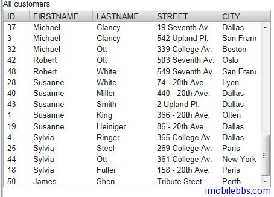

# SQLContainer-编辑

和普通 Container 修改其中 Item 项类似，SQLContainer 可以使用类似的方法来编辑其中的Item。RowItem 的 ColumnProperties 会自动通知 SQLContainer 关于数据的变化并应用到数据库。

## 添加 Item

向 SQLContainer 中添加一项是通过方法 addItem()来完成的。这个方法将创建一个新的 Item，新创建的 Item 可以在内存中缓存或直接添加到数据库中。这取决于 SQLContainer 的 auto commit 模式。
实际也只能通过 addItem() 方法向 SQLContainer 中添加记录，其它由 Container 定义的方法SQLContainer 并不支持：

```
public boolean addContainerProperty(Object propertyId,
                                    Class<?> type,
                                    Object defaultValue)
public boolean removeContainerProperty(Object propertyId)
public Item addItem(Object itemId)
public Object addItemAt(int index)
public Item addItemAt(int index, Object newItemId)
public Object addItemAfter(Object previousItemId)
public Item addItemAfter(Object previousItemId, Object newItemId)
```

此外 RowItem 不支持的 Item 方法有：

```
public boolean addItemProperty(Object id, Property property)
public boolean removeItemProperty(Object id)
```

下面的例子向 Customer 表中添加一个记录 James ,Shen, Tribute Street, Perth

```
void addCustomer(SQLContainer sqlContainer){
		
	sqlContainer.setAutoCommit(false);
	TemporaryRowId rowId=(TemporaryRowId)sqlContainer.addItem();
	if(rowId!=null){
		RowItem rowItem=(RowItem)sqlContainer.getItem(rowId);
		ColumnProperty firstName=(ColumnProperty)rowItem.getItemProperty("FIRSTNAME");
		firstName.setValue("James");
		ColumnProperty lastName=(ColumnProperty)rowItem.getItemProperty("LASTNAME");
		lastName.setValue("Shen");
		ColumnProperty street=(ColumnProperty)rowItem.getItemProperty("STREET");
		street.setValue("Tribute Steet");
		ColumnProperty city=(ColumnProperty)rowItem.getItemProperty("CITY");
		city.setValue("Perth");
		ColumnProperty Id=(ColumnProperty)rowItem.getItemProperty("ID");
		Id.setValue(50);
		rowItem.commit();
		
	}
}
```


整体感觉使用 SQLContainer 编辑数据并不十分方便，还不如直接使用 SQL 语句或是使用hibernate.来的方便。

Tags: [Java EE](http://www.imobilebbs.com/wordpress/archives/tag/java-ee), [Vaadin](http://www.imobilebbs.com/wordpress/archives/tag/vaadin), [Web](http://www.imobilebbs.com/wordpress/archives/tag/web)
