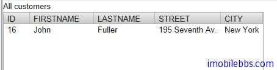
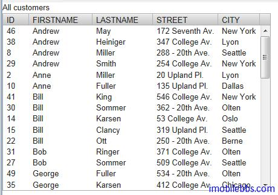

# SQLContainer-过滤及排序

SQLContainer 的过滤及排序在设计时总是通过数据库操作来完成，也就是说在使用 Filter 和Sorting 时应用与数据库之间会发生通信。实际上 Filter 对应到 SQL 语句的 WHERE 语句，Sorting 则对应到 ORDER BY 语句。

除了 Container 支持的 Filter 之外（可以参见 [Vaadin Web 应用开发教程(44): 使用 Container 接口管理一组 Item](http://www.imobilebbs.com/wordpress/?p=3443)），SQLContainer 也支持 Like 和 Between  过滤器。 它们也对应到WHERE语句。

比如我们要查询名字叫“John” 住在”New York” 的客户。

```
container.addContainerFilter(
				   new And (new Equal("FIRSTNAME", "John"),
						   new Equal("CITY","New York")));
```

这实际上是执行：

select * from customer    
where FirstName='John' and city='New York'



排序可以使用 Vaadin 提供的 Sort 方法，其参数定义如下：

```
public void sort(Object[] propertyId, boolean[] ascending)
```

此外还可以使用 addOrderBy 方法。

比如按客户的 FirstName 排序

```
container.addOrderBy(new OrderBy("FIRSTNAME",true));
```



Tags: [Java EE](http://www.imobilebbs.com/wordpress/archives/tag/java-ee), [Vaadin](http://www.imobilebbs.com/wordpress/archives/tag/vaadin), [Web](http://www.imobilebbs.com/wordpress/archives/tag/web)