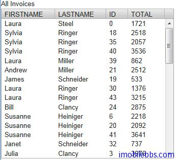

# SQLContainer-使用 FreeformQuery

在大部分情況下使用 TableQuery 就可以滿足應用要求，如果需要使用複雜查詢，比如多表查詢，則可以使用 FreeformQuery。 預設情況下 FreeformQuery 為只讀，如果需要支持寫操作，可以自行實現FreeformQueryDelegate 介面。

```
// Read-only queries
public StatementHelper getCountStatement()
public StatementHelper getQueryStatement(int offset, int limit)
public StatementHelper getContainsRowQueryStatement(Object... keys)

// Filtering and sorting
public void setFilters(List<Filter> filters)
public void setFilters(List<Filter> filters,
                       FilteringMode filteringMode)
public void setOrderBy(List<OrderBy> orderBys)
 
// Write support
public int storeRow(Connection conn, RowItem row)
public boolean removeRow(Connection conn, RowItem row)
```

本例使用多表查詢，查詢語句如下：

```
SELECT C.FIRSTNAME , C.LASTNAME , INV.ID,INV.TOTAL 
FROM CUSTOMER C 
INNER JOIN INVOICE INV
ON C.ID=INV.CUSTOMERID;
```

```
void openTable(VerticalLayout layout){
	try {
		JDBCConnectionPool pool = new SimpleJDBCConnectionPool(
				"org.hsqldb.jdbc.JDBCDriver",
				"jdbc:hsqldb:file:/hsqldb/data/sample", "SA", "", 2, 5);
		FreeformQuery query = new FreeformQuery(
				"SELECT C.FIRSTNAME , " +
				"C.LASTNAME , INV.ID,INV.TOTAL " +
				"FROM CUSTOMER C " +
				"INNER JOIN INVOICE INV " +
				"ON C.ID=INV.CUSTOMERID;", pool, "ID");
		SQLContainer container = new SQLContainer(query);
		Table table = new Table("All Invoices", container);
		table.setSelectable(true);

		layout.addComponent(table);
		
	} catch (SQLException e) {
		// TODO Auto-generated catch block
		e.printStackTrace();
	}
	}
```



到目前為止，基本介紹完 SQLContainer 的用法，不過整體來說 SQLContainer 雖然使用簡單方便，當功能有限，對應複雜的資料庫應用還是可以直接使用 JDBC 和 JPA 等。

Tags: [Java EE](http://www.imobilebbs.com/wordpress/archives/tag/java-ee), [Vaadin](http://www.imobilebbs.com/wordpress/archives/tag/vaadin), [Web](http://www.imobilebbs.com/wordpress/archives/tag/web)