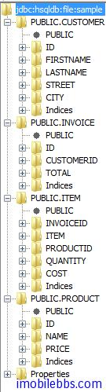
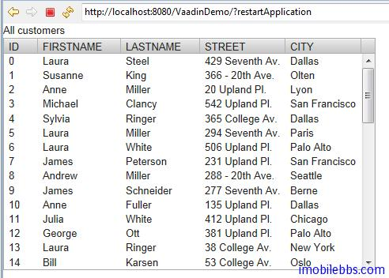
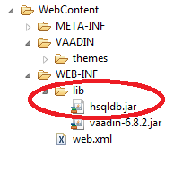

# 开始使用 SQLContainer

在 Vaadin 中使用 SQLContainer 简单而直接，本篇及后面几篇将使用 HSQLDB 为例，HSQLDB 为一纯 JAVA 实现的数据库系统，支持多种模式，如服务器模式（如其它数据库服务器比如 Sql server, MySQL) 或者作为应用程序的一部分，或是直接使用内存。 本例使用 HSQLDB 的主要原因是因其简单，不需要另外安装数据库服务器，只要使用 jar 包，例子使用随 HSQLDB 下载包中提供的示例数据。
其创建数据表的语句如下：

```
CREATE TABLE Customer(ID INTEGER PRIMARY KEY,FirstName VARCHAR(20),LastName VARCHAR(30),Street VARCHAR(50),City VARCHAR(25));
CREATE TABLE Product(ID INTEGER PRIMARY KEY,Name VARCHAR(30),Price DECIMAL);
CREATE TABLE Invoice(ID INTEGER PRIMARY KEY,CustomerID INTEGER,Total DECIMAL, FOREIGN KEY (CustomerId) REFERENCES Customer(ID) ON DELETE CASCADE);
CREATE TABLE Item(InvoiceID INTEGER,Item INTEGER,ProductID INTEGER,Quantity INTEGER,Cost DECIMAL,PRIMARY KEY(InvoiceID,Item), FOREIGN KEY (InvoiceId) REFERENCES Invoice (ID) ON DELETE CASCADE, FOREIGN KEY (ProductId) REFERENCES Product(ID) ON DELETE CASCADE);
```



这里我们把 sample 数据库创建在 C:/hsqldb/data 目录下：
显示 Customer 表格的基本代码如下：

```
void openTable(VerticalLayout layout){
		try {
			JDBCConnectionPool pool = new SimpleJDBCConnectionPool(
			        "org.hsqldb.jdbc.JDBCDriver",
			        "jdbc:hsqldb:file:/hsqldb/data/sample", "SA", "", 2, 5);
			TableQuery tq = new TableQuery("Customer", pool);
			tq.setVersionColumn("OPTLOCK");
			SQLContainer container = new SQLContainer(tq);
			// Bind a table to it
			Table table = new Table("All customers", container);
		    layout.addComponent(table);

		} catch (SQLException e) {
			// TODO Auto-generated catch block
			e.printStackTrace();
		}
	}
```

可以看到使用 SQLContainer 的基本步骤如下：
1. 创建数据库连接 ，这里使用 SimpleJDBCConnectionPool

```
JDBCConnectionPool pool = new SimpleJDBCConnectionPool(
			        "org.hsqldb.jdbc.JDBCDriver",
			        "jdbc:hsqldb:file:/hsqldb/data/sample", "SA", "", 2, 5);
```

不同的数据可以的连接字符串 jdbc:hsqldb:file:/hsqldb/data/sample 不同，这里连接到一个文件数据库，如果使用内存数据库，连接字符串可以为 jdbc:hsqldb:mem:sqlcontainer。

2. 有了数据库连接之后，就可以创建一个 TableQuery，给出需要查询的数据库表名，本例使用表Customer.
3. 如果需要支持多用户连接数据库，可以设定数码库锁定的方式。 本例使用 OptimisticLock. ( 可选）
4. 最后创建一个 SQLContainer 对象。

显示如下：



注意： 你需要将下载的 HSQLDB 数据库的 jar 包放在项目的 WebContent/WEB-INF/lib 目录下：



Tags: [Java EE](http://www.imobilebbs.com/wordpress/archives/tag/java-ee), [Vaadin](http://www.imobilebbs.com/wordpress/archives/tag/vaadin), [Web](http://www.imobilebbs.com/wordpress/archives/tag/web)