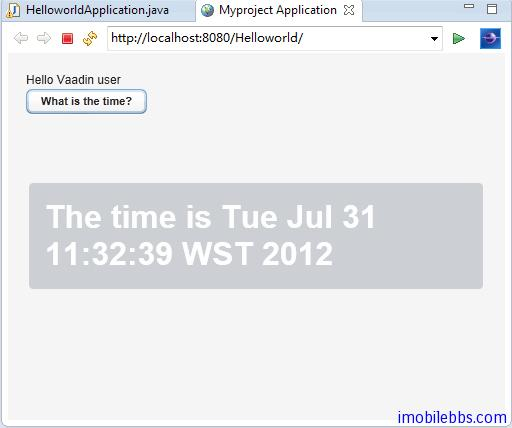

# 開始編寫 Web 應用

在前面 [Vaadin Web 應用開發教程(2):安裝開發環境](http://www.imobilebbs.com/wordpress/?p=3139) 我們創建了一個 Helloworld 項目，現在回過頭詳細說明一個這個簡單 Web 應用。

使用 Eclipse Vaadin 插件創建項目，自動生成的項目目錄如下：


可以看到，Vaadin 庫文件放在目錄 Webcontent/WEB-INF/lib 下，生成的 Web 應用主程序放在 src 目錄下，而部署描述文件 web.xml 則放在 Webcontent/WEB-INF 目錄下。

有 Vaadin 插件創建的初始 Application 類定義如下：

```
package com.example.helloworld;

import com.vaadin.Application;
import com.vaadin.ui.*;

public class HelloworldApplication extends Application {
	@Override
	public void init() {
		Window mainWindow = new Window("Helloworld Application");
		Label label = new Label("Hello Vaadin user");
		mainWindow.addComponent(label);
		setMainWindow(mainWindow);
	}

}
```

所有的 Vaadin Web 應用都必須派生 com.vaadin.Application 類作為 Web 應用的主入口。而派生類必須實現 init 用於初始化工作（比如定義應用的主界面，設置應用的顯示主題，訪問 Window 對象等）。類 Application 提供的方法和 Java Servlet 提供的 API 非常類似，但這只是個表象，Vaadin 提供的 Application 類是很 Session 類相關的。實際上 Application 對象為一 Session對象，因此上實現 Vaadin 編寫 Web 應用和使用 Java SE Swing 編寫桌面應用非常相像。

Vaadin 應用中運行是為運行在伺服器端 Servlet 容器中的一個 HTTP Servlet ，下圖為 Vaadin Web 應用程序的總體框架圖：


應用的入口點為 Application 類，一般在 Application 的 init 方法中定義程序的 UI，設置應用的顯示主題，定義事件處理函數。UI 控制項可以通過數據綁定來操作數據的讀寫等。這和編寫一般的桌面應用非常類似。

修改一下 Application 的 init 方法，添加一個按鈕，點擊這個按鈕之後，顯示當前時間。代碼如下：

```
public class HelloworldApplication extends Application {
	@Override
	public void init() {
		final Window mainWindow = 
			      new Window("Myproject Application");

			   Label label = new Label("Hello Vaadin user");
			   mainWindow.addComponent(label);

			   mainWindow.addComponent(
			      new Button("What is the time?",
			         new Button.ClickListener() {
			         public void buttonClick(ClickEvent event) {
			            mainWindow.showNotification(
			               "The time is " + new Date());
			         }
			      }));  setMainWindow(mainWindow);
	}

}
```

為應用定義 UI ,首先創建一個根 View，通常為 Windows 對象，然後創建其它 UI 組件，如 Label，Button，通過 addComponent 添加到 windows 對象中（使用預設的布局方法）。然後使用addListener 為 Button 添加按鍵處理方法。最後使用 setMainWindow(mainWindow) 為應用設置主窗口。這和編寫桌面應用沒什麼不同。開發人員無需了解底層的 HTML, AJAX, JavaScript ，這些都有 Vaadin 庫來管理。

運行結果如下：



編寫測試應用之後，就是如何部署 Web 應用，由 Vaadin 編寫的應用最後打包成單一的 War 文件，可以使用 Tomcat 或其它 Application 應用伺服器直接部署這個 war 文件。

web.xml 為部署描述文件，本例如下：

```
<?xml version=”1.0″ encoding=”UTF-8″?>
<web-app id=”WebApp_ID” version=”2.4″
   xmlns=”http://java.sun.com/xml/ns/j2ee”
   xmlns:xsi=”http://www.w3.org/2001/XMLSchema-instance”
   xsi:schemaLocation=”http://java.sun.com/xml/ns/j2ee
   http://java.sun.com/xml/ns/j2ee/web-app_2_4.xsd“>
 <display-name>Helloworld</display-name>
 <context-param>
  <description>
  Vaadin production mode</description>
  <param-name>productionMode</param-name>
  <param-value>false</param-value>
 </context-param>
 <servlet>
  <servlet-name>Helloworld Application</servlet-name>
  <servlet-class>com.vaadin.terminal.gwt.server.ApplicationServlet</servlet-class>
  <init-param>
   <description>
   Vaadin application class to start</description>
   <param-name>application</param-name>
   <param-value>com.example.helloworld.HelloworldApplication</param-value>
  </init-param>
 </servlet>
 <servlet-mapping>
  <servlet-name>Helloworld Application</servlet-name>
  <url-pattern>/*</url-pattern>
 </servlet-mapping>
 <welcome-file-list>
  <welcome-file>index.html</welcome-file>
  <welcome-file>index.htm</welcome-file>
  <welcome-file>index.jsp</welcome-file>
  <welcome-file>default.html</welcome-file>
  <welcome-file>default.htm</welcome-file>
  <welcome-file>default.jsp</welcome-file>
 </welcome-file-list>
</web-app>
```

一般無需修改，後面將有詳細描述。

使用 Apache Tomcat 部署 Vaadin 應用的一般步驟如下：

1. 在 Eclipse 中使用 File->Export->Web ->War File 生成 應用的打包文件. war 文件。

2. 使用 tomcat 的控制台 ，預設 URL 為 http://[web site]:8080


3. 使用 tomcat 部署成功後，就可以使用 http://[web url]:8080/[web app] 來訪問這個 Web應用。比如 http://www.guidebee.net:8080/sampler

4. 如果你不希望使用:8080 來訪問這個應用，可以通過修改 apache 的配置文件 ，一般目錄為 /etc/apache2/apache2.conf

   添加一行類似 ProxyPass /sampler http://www.guidebee.net:8080/sampler 

  然後你就可以用 http://www.guidebee.net/sampler 來訪問這個 Web 應用了。

Tags: [Java EE](http://www.imobilebbs.com/wordpress/archives/tag/java-ee), [Vaadin](http://www.imobilebbs.com/wordpress/archives/tag/vaadin), [Web](http://www.imobilebbs.com/wordpress/archives/tag/web)
