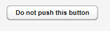

# UI 組件-Button

Button 按鈕，在前面 Vaadin Web 應用開發教程(5):Vaadin Web 應用的基本組成部分中介紹事件處理時已經對 Button 的用法做了說明。當用戶點擊按鈕時會觸發 Button.ClickEvent ，可以使用 Button.ClickListener 來偵聽這個事件。

```
public class TheButton extends CustomComponent
                       implements Button.ClickListener {
    Button thebutton;

    public TheButton() {
        // Create a Button with the given caption.
        thebutton = new Button ("Do not push this button");

        // Listen for ClickEvents.
        thebutton.addListener(this);

        setCompositionRoot(thebutton);
    }

    /** Handle click events for the button. */
    public void buttonClick (Button.ClickEvent event) {
        thebutton.setCaption ("Do not push this button again");
    }}
```



為多個按鈕使用同一個 Listener 時，可以通過 Event 的 getButton() 方法來區分不同的按鈕。

Tags: [Java EE](http://www.imobilebbs.com/wordpress/archives/tag/java-ee), [Vaadin](http://www.imobilebbs.com/wordpress/archives/tag/vaadin), [Web](http://www.imobilebbs.com/wordpress/archives/tag/web)