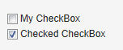

# UI 組件-Checkbox

Checkbox 的狀態可以為 checked 和 unchecked. 其值可以通過 getValue, setValue 來操作。基本用法如下：

// A check box with default state (not checked, false).
final CheckBox checkbox1 = new CheckBox("My CheckBox");
main.addComponent(checkbox1);

// Another check box with explicitly set checked state.
final CheckBox checkbox2 = new CheckBox("Checked CheckBox");
checkbox2.setValue(true);
main.addComponent(checkbox2);

// Make some application logic. We use anonymous listener
// classes here. The above references were defined as final
// to allow accessing them from inside anonymous classes.
checkbox1.addListener(new ValueChangeListener() {
    public void valueChange(ValueChangeEvent event) {
        // Copy the value to the other checkbox.
        checkbox2.setValue(checkbox1.getValue());
    }
});
checkbox2.addListener(new ValueChangeListener() {
    public void valueChange(ValueChangeEvent event) {
        // Copy the value to the other checkbox.
        checkbox1.setValue(checkbox2.getValue());
    }
});
checkbox1.setImmediate(true);
checkbox2.setImmediate(true);

Checkbox 除了單獨使用之外，還可以應用到 OptionGroup 和 Tabel 中，具體參見後續文章。

Tags: [Java EE](http://www.imobilebbs.com/wordpress/archives/tag/java-ee), [Vaadin](http://www.imobilebbs.com/wordpress/archives/tag/vaadin), [Web](http://www.imobilebbs.com/wordpress/archives/tag/web)

