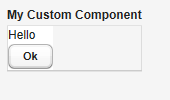

# UI 组件-自定义组件

Vaadin 支持自定义组件，典型的用法是将各种 Vaadin 内置的组件组合而成构成自定义组件。 创建自定义组件可以通过派生 CustomComponent 然后调用 setCompositionRoot 为自定义组件设置根容器。
例如：

```
class MyComposite extends CustomComponent {
    public MyComposite(String message) {
        // A layout structure used for composition
        Panel panel = new Panel("My Custom Component");
        panel.setContent(new VerticalLayout());
        
        // Compose from multiple components
        Label label = new Label(message);
        label.setSizeUndefined(); // Shrink
        panel.addComponent(label);
        panel.addComponent(new Button("Ok"));

        // Set the size as undefined at all levels
        panel.getContent().setSizeUndefined();
        panel.setSizeUndefined();
        setSizeUndefined();

        // The composition root MUST be set
        setCompositionRoot(panel);
    }}
```



需要注意的是，如果希望自定义的组件自适应其所包含的其它UI组件，必须将容器的大小设为“未定义”,如上面的 setSizeUndefined 方法就是起这个作用。
构造自定义组件，也可以从其它 Vaadin 内置 UI 组件派生，或者利用 Google Web Toolbit 提供的组件创建全新的 Vaadin UI 组件（后面介绍）。

Tags: [Java EE](http://www.imobilebbs.com/wordpress/archives/tag/java-ee), [Vaadin](http://www.imobilebbs.com/wordpress/archives/tag/vaadin), [Web](http://www.imobilebbs.com/wordpress/archives/tag/web)