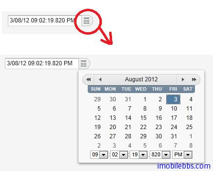
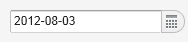
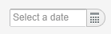
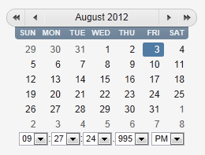

# UI 組件-DateField

DateField 用於顯示和輸入日期和時間。它有兩個變種：一是 PopupDateField ，以 Popup 日曆選取框，另外為 InlineDateField，會一直顯示日期選擇窗口。DateField 預設使用 Popup 方式。

下面代碼為 DateField 的基本使用方法：

```
// Create a DateField with the default style
DateField date = new DateField();

// Set the date and time to present
date.setValue(new Date());
```



DateField 使用預設的 Locale 的格式顯示日期和時間，你也可以通過方法 setDateFormat 直接指定日期的顯示格式。
比如：

```
// Display only year, month, and day in ISO format
date.setDateFormat("yyyy-MM-dd");
```



用戶輸入日期和時間時經常會輸入非法的時間，DateField 用兩層驗證：客戶端驗證和伺服器端驗證，首先是客戶端驗證，一旦 DateField 失去焦點，如果輸入的日期非法，則使用 v-datefield-parseerror 風格顯示錯誤。
是否顯示錯誤標識還取決於當前主題，內置的 reindeer 主題不顯示任何錯誤標識。在這種情況下則方便使用伺服器端驗證。
當使用 setLenient(true)時，則使用較為寬鬆的驗證方法，一些非法日期，比如2月30日則會自動變換到三月份。
伺服器端驗證發生在日期的值發送到伺服器後，如果將 DateField 模式設為 immediate 模式，當DateField 失去焦點後，日期發送到伺服器觸發驗證事件。此時如果輸入的日期非法，則顯示錯誤標識。
你可以通過重寫 handleUnparsableDateString() 來自定義日期錯誤。除此之外你也可以重新定義錯誤消息。
你可以使用 setInputPrompt 方法提示用戶在需要輸入日期的地方輸入日期：

```
// Set the prompt
date.setInputPrompt("Select a date");

// Set width explicitly to accommodate the prompt
date.setWidth
```



而 InlineDateField 提供了日期和時間的選擇窗口。用戶可以通過前翻後翻選擇合適的時間和日期。

```
// Create a DateField with the default style
InlineDateField date = new InlineDateField();

// Set the date and time to present
date.setValue(new java.util.Date());
```



Tags: [Java EE](http://www.imobilebbs.com/wordpress/archives/tag/java-ee), [Vaadin](http://www.imobilebbs.com/wordpress/archives/tag/vaadin), [Web](http://www.imobilebbs.com/wordpress/archives/tag/web)

