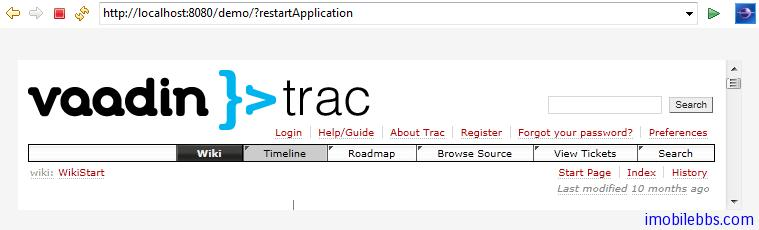

# UI 组件-Embedded 组件

Embedded 组件支持者浏览器中嵌入媒体对象，如图像，动画等其它浏览器支持的媒体类型。Embedded组件内容在 Vaadin 中是作为资源来管理的。

```
Embedded image = new Embedded("Yes, logo:",
    new ClassResource("vaadin-logo.png", this));
main.addComponent(image);
```


Embedded 组件支持多种显示内容，可以通过 setType()来设置嵌入对象的类型。
Embedded.TYPE_OBJECT 缺省内容类型，实现渲染时为 HTML

The Embedded.TYPE_OBJECT 支持浏览器嵌入媒体，目前只支持显示 Flash 动画，它的 MIME 类型为application/x-shockwave-flash.

```
// Create a Shockware Flash resource
final ClassResource flashResource =
    new ClassResource("itmill_spin.swf", getApplication());

// Display the resource in a Embedded compoant
final Embedded embedded =
    new Embedded("Embedded Caption", flashResource);

// This is the default type, but we set it anyway.
embedded.setType(Embedded.TYPE_OBJECT);

// This is recorgnized automatically, but set it anyway.
embedded.setMimeType("application/x-shockwave-flash");
```

可以通过方法 setParameter 为对象设置参数。

Embedded.TYPE_IMAGE 用来显示图像，通常无需明确指定其类型。 Embedded 组件缺省未定义宽度和高度，因此可以自动适应所显示图像的大小，如果需要使用滚动条，可以在 Panel 中嵌入 Embedded 组件。
如果需要显示动态生成的图像，比如从 StreamResource 显示图像并且显示对象发生变化，就需要在浏览器重新加载图像，不同浏览器处理缓存 Cache 的方法不同，因此保险的方法是为动态生成的图像使用不同的文件名，
并在创建图像使用 setCacheTime 将 Cache 时间设为0.

```
// Create the stream resource with some initial filename.
StreamResource imageResource =
    new StreamResource(imageSource, "initial-filename.png",
                       getApplication());

// Instruct browser not to cache the image.
imageResource.setCacheTime(0);

// Display the image in an Embedded component.
Embedded embedded = new Embedded("", imageResource);
```

刷新图像使用 requestRepaint() 方法。

```
// This needs to be done, but is not sufficient.
embedded.requestRepaint();

// Generate a filename with a timestamp.
SimpleDateFormat df = new SimpleDateFormat("yyyyMMddHHmmssSSS");
String filename = "myfilename-" + df.format(new Date()) + ".png";

// Replace the filename in the resource.
imageResource.setFilename(makeImageFilename());
```

Embedded.TYPE_BROWSER 在 iframe 中显示一个外部链接。

```
URL url = new URL("http://dev.vaadin.com/");
Embedded browser = new Embedded("", new ExternalResource(url));
browser.setType(Embedded.TYPE_BROWSER);
main.addComponent(browser);
```



Tags: [Java EE](http://www.imobilebbs.com/wordpress/archives/tag/java-ee), [Vaadin](http://www.imobilebbs.com/wordpress/archives/tag/vaadin), [Web](http://www.imobilebbs.com/wordpress/archives/tag/web)
