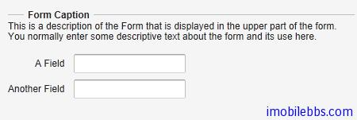
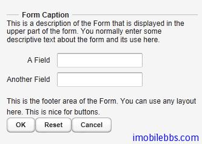
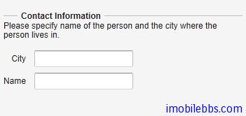
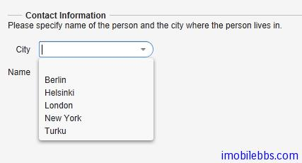
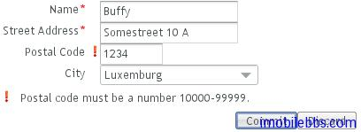
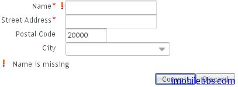

# UI组件-Form组件

大部分的 Web 应用都包含窗体(Form)，Vaadin 中的 Form 组件提供了创建窗体的简洁方法。窗体中的填充域可以直接由绑定的数据源自动生成。BeamItem 适配器(Adapter)支持使用 Java Bean 对象或是普通的 Java 对象做为数据源。 Form 组件支持窗体数据的缓存从而只需在填写 Form 完成后一次性提交。
Form 组件从 Layout 派生，可以有边框，标题，描述以及错误提示标识。
和大部分 UI 组件不同的是，Form 构造函数不支持传入窗体标题参数，因为 From 经常不需要显示标题。你可以使用 setCaption 为窗体添加标题。setDescription 可以为窗体添加帮助提示。Form 组件缺省使用 FormLayout 布局，但你可以使用 setLayout 为 Form 组件设置其它 Layout 对象。
Form 组件可以包含其它UI组件，你可以直接创建 UI 组件如何添加到 Form 组件的 Layout 对象中，但更好的方法是使用数据绑定。
下面代码显示两种方法为 Form 添加其它 UI 输入组件，如何添加到窗体中：

```
Form form = new Form();
form.setCaption("Form Caption");
form.setDescription("This is a description of the Form that is " +
"displayed in the upper part of the form. You normally " +
"enter some descriptive text about the form and its " +
"use here.");

// Add a field directly to the layout. This field will
// not be bound to the data source Item of the form.
form.getLayout().addComponent(new TextField("A Field"));

// Add a field and bind it to an named item property.
form.addField("another", new TextField("Another Field"));
```



Form 组件可以显示输入错误标识，它可以显示下面几种错误类型：

- 由 setComponentError 设置的错误内容。
- 由 addValidator 添加到窗体的 Validator 生成的错误。
- 由窗体中 UI 域所关联的 Validator 引起的错误。此时 setValidatorVisible(true)
- 当 setRequired(true) 和 setRequiredError 同时设置时未填写某个必需内容时引发的校验错误。
但 Form 组件同时只能显示单个错误。
此外 Form 组件还定义了页脚区域(footer)，footer 缺省使用 HorizontalLayout 布局。但也可以使用 setFooter 来修改缺省布局。

```
// Set the footer layout.
form.setFooter(new VerticalLayout());

form.getFooter().addComponent(
new Label("This is the footer area of the Form. "+
"You can use any layout here. "+
"This is nice for buttons."));

// Have a button bar in the footer.
HorizontalLayout okbar = new HorizontalLayout();
okbar.setHeight("25px");
form.getFooter().addComponent(okbar);

// Add an Ok (commit), Reset (discard), and Cancel buttons
// for the form.
Button okbutton = new Button("OK", form, "commit");
okbar.addComponent(okbutton);
okbar.setComponentAlignment(okbutton, Alignment.TOP_RIGHT);
okbar.addComponent(new Button("Reset", form, "discard"));
okbar.addComponent(new Button("Cancel"));
```



上面介绍了 Form 组件的基本用法，接着介绍 Form 组件如何利用数据绑定来自动创建 UI 填充域。
数据绑定使用的数据源可以为任何实现 Item 接口的 Java 对象。你可以自行实现 Item 接口或是使用BeamItem Adapter 将 Form 组件绑定到任意的 JavaBean 对象。 也可以使用 PropertysetItem 将 Form 组件绑定到一个 Propert 对象集合。
下面代码定义了个简单的 Java Bean 对象-PersonBean.

```
/** A simple JavaBean. */
public class PersonBean {
String name;
String city;

public void setName(String name) {
this.name = name;
}

public String getName() {
return name;
}

public void setCity(String city) {
this.city = city;
}

public String getCity() {
return city;
}
}
```

如何使用 BeanItem 适配器将一个 PersonBean 对象绑定到 Form 组件。

```
// Create a form and use FormLayout as its layout.
final Form form = new Form();

// Set form caption and description texts
form.setCaption("Contact Information");
form.setDescription("Please specify name of the person and the city where the person lives in.");

// Create the custom bean.
PersonBean bean = new PersonBean();

// Create a bean item that is bound to the bean.
BeanItem item = new BeanItem(bean);

// Bind the bean item as the data source for the form.
form.setItemDataSource(item);
```

绑定数据源后，Form 组件使用 FormLayout，并为 Java Bean 的每个属性自动创建对应的 UI 组件（如文本框）。如下图所示：



这种自动创建的 UI 域的顺序可以不是我们所希望的，这时可以使用 setVisibleItemPropertyies 来修改 UI 域的显示顺序，比如：

```
// Set the order of the items in the form.
Vector order = new Vector();
order.add("city");
order.add("name");
form.setVisibleItemProperties(order);
```

这种自动创建的 UI 组件的标题缺省使用 JavaBean 对应的属性名称，你可以使用 FieldFactory 来修改缺省标题。
自动创建的 UI 域具有一定的局限性，比如 String, int 或 double 类型的属性会自动对应到TextField 组件。而此时你可以希望使用 Combo 组件来输入城市名称。 FormFieldFactory 接口用来解决这些局限。
FieldFactory 的缺省实现 DefaultFieldFactory 也用于 Table 组件。 通常可以通过派生DefaultFieldFactory 的方法来定制 FieldFactory。
下面为 FormFieldFactory 接口的一个简单实现，为 city 使用一个 Select 组件。

```
class MyFieldFactory implements FormFieldFactory {
public Field createField(Item item, Object propertyId,
Component uiContext) {
// Identify the fields by their Property ID.
String pid = (String) propertyId;
if ("name".equals(pid)) {
return new TextField("Name");
} else if ("city".equals(pid)) {
Select select = new Select("City");
select.addItem("Berlin");
select.addItem("Helsinki");
select.addItem("London");
select.addItem("New York");
select.addItem("Turku");
select.setNewItemsAllowed(true);
return select;
}

return null; // Invalid field (property) name.
}
}

...

form.setFormFieldFactory(new MyFieldFactory());
```



此外使用 Form 组件的一个重要功能是验证用户输入，Vaadin 再 UI 域（Field）可以关联到validator 来验证用户输入以保证输入合法。
Vaadin 的 validator 为实现了 Validator 接口的类。 这个接口定义了两个方法，isValid 和validate.
Vaadin 内置了一些常用的验证类，如 IntegerValidator, DoubleValidator, StringLengthValidator, EmailValidator 以及 RegexValidator 等。
Form 校验发生在用户点击“提交”按钮时，当窗体中任何一个 Validator 失败时，窗体提交都会失败，并显示与之关联的错误标识。如果提交成功，输入数据则写到数据源中。
比如下面代码要求邮编满足给定格式。

```
// Postal code that must be 5 digits (10000-99999).
TextField field = new TextField("Postal Code");
field.setColumns(5);

// Create the validator
Validator postalCodeValidator = new RegexpValidator(
"[1-9][0-9]{4}", "Postal code must be a number 10000-99999.");
field.addValidator(postalCodeValidator);
```



如果需要指定窗体中某些域是必需填写的，可以使用 setRequired(true)，并使用setRequiredError 设置错误信息在用户没有填写必填输入内容时显示。

```
form.getField("name").setRequired(true);
form.getField("name").setRequiredError("Name is missing");
form.getField("address").setRequired(true); // No error message
```



最后提一下 Form 组件的缓存功能，可以只在用户点击”提交“按钮后才将用户输入数据写回数据源。其实 Vaadin 的所有 Field 组件都支持缓存功能。而 Form 的 commit ,discard 实际上是调用对应的 Field 组件的相关功能。当调用 discard 后，将失去之前用户所有修改，UI 输入域恢复到数据源的初始内容。

```
final Form form = new Form();
...add components...

// Enable buffering.
form.setWriteThrough(false);

// The Ok button calls form.commit().
Button commit = new Button("Ok", form, "commit");

// The Restore button calls form.discard().
Button restore = new Button("Restore", form, "discard");
```

Tags: [Java EE](http://www.imobilebbs.com/wordpress/archives/tag/java-ee), [Vaadin](http://www.imobilebbs.com/wordpress/archives/tag/vaadin), [Web](http://www.imobilebbs.com/wordpress/archives/tag/web)