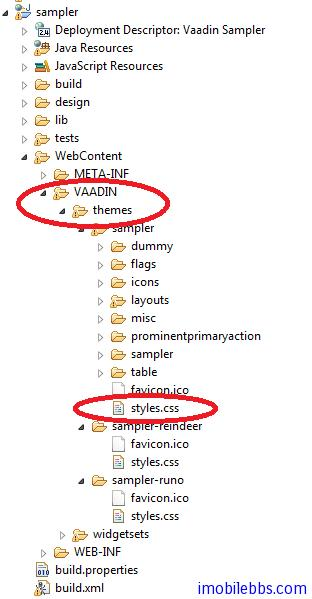
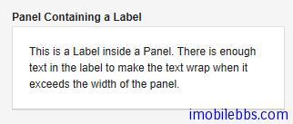
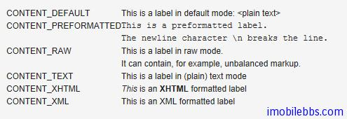
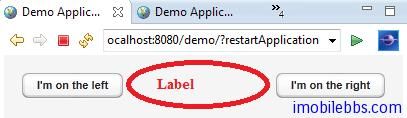

# UI 組件-Label

從本篇開始介紹 Vaadin 提供的 UI 組件的基本用法，這些 UI 組件包括 Label, Link, TextField, TextArea, PasswordField, RichTextArea, DateField, Button, CheckBox, Select, Table, Tree ,MenuBar, Embeded, Upload, Form, ProgressIndicator, Slider, LoginForm 以及自定義 CustomComponent。 這些 UI 控制項基本上都可以找到 Java Swing 或其它桌面系統對應的 UI 組件，功能上也類似。

在 Vaadin Web 應用中影響 UI 組件外觀的除了使用代碼，還可以通過 Theme 中的 CSS 來定義，這一點和一般的桌面系統稍有不同，不過如果使用 Vaadin 預設的風格，你也可以暫時不要去關心如何使用 CSS。如果你想修改某個 UI 組件的 CSS 風格，可以參考 sampler ，styles.css 定義在某個的Theme 下，如下圖項目結構所示：



而 Vaadin CSS 的 CSS 選擇標識一般以 v- 為前綴，比如 Label 的 CSS 風格為 v-label ,TextField 使用點劃線邊框 使用 .v-textfield-dashing 等。具體可以參 Vaadin 文檔。

儘管 Vaadin 提供的 UI 組件的用法和一般桌面 UI 的開發非常類似，你可以選擇跳過這些教程，但建議你還是看一遍，了解一下 Vaadin UI 組件這使用方法上可能的不同。

Label 一般用來顯示一些不需要編輯的文本，可以格式化顯示文字，這取決於 Label 的 Content 模式。最好的學習UI組件的方法是通過創建一個項目，寫一些代碼看看每個 UI 組件所能提供的功能和外觀。Label 預設可以通過長文字的自動換行，這就要求 Label 的父容器定義了寬度，對應某些沒有定義預設寬度的 Layout，如 HorizontalLayout 需要多加註意。

Label 的基本用法：

```
// A container that is 100% wide by default
VerticalLayout layout = new VerticalLayout();

Label label = new Label("Labeling can be dangerous");
layout.addComponent(label);
```

定義父容器的寬度，顯示長文字時，Label 自動換行：

```
// A container with a defined width. The default content layout
// of Panel is VerticalLayout, which has 100% default width.
Panel panel = new Panel("Panel Containing a Label");
panel.setWidth("300px");

panel.addComponent(
    new Label("This is a Label inside a Panel. There is " +
              "enough text in the label to make the text " +
              "wrap when it exceeds the width of the panel."));
```

結果如下所示：



Label 的預設寬度為100%,此時 Label 會自動換行，如果將 Label 的寬度設為 undefined ，Label 不會自動換行，如果過長，一般會被截斷。

- Content 模式 ，Label 顯示文字的結果還取決於 Label 的 Content 模式，Label 的預設模式為純文字，可以顯示任何字元，包括 XML 標記符 。Label 支持的 Content 模式有如下幾種：

- CONTENT_DEFAULT:預設模式，同 CONTENT_TEXT.
- CONTENT_PREFORMATTED:Label 顯示預定義格式的文本，一般使用固定寬度的打字機字體顯示，可以顯示換行符，製表符等。
- CONTENT_RAW：可以顯示原始的 HTML 字元串。 顯示的字元串沒有必要為合法的 XM。一般用來顯示對格式沒有嚴格要求的原始的 HTML 字元串。
- CONTENT_TEXT： 純文本顯示，可以顯示任何字元，包括<,>,& 等特殊的 XML，HTML實體。這些字元顯示時會自動使用引號進行轉義以正確顯示。
- CONTENT_XHTML： 顯示 XHTML 字元串，
- CONTENT_XML： 所顯示的字元串為規範的 XML 文檔。
下面示例使用上述幾種模式來顯示文字：

```
GridLayout labelgrid = new GridLayout (2,1);

labelgrid.addComponent (new Label ("CONTENT_DEFAULT"));
labelgrid.addComponent (
    new Label ("This is a label in default mode: <plain text>",
               Label.CONTENT_DEFAULT));

labelgrid.addComponent (new Label ("CONTENT_PREFORMATTED"));
labelgrid.addComponent (
    new Label ("This is a preformatted label.\n"+
               "The newline character \\n breaks the line.",
               Label.CONTENT_PREFORMATTED));

labelgrid.addComponent (new Label ("CONTENT_RAW"));
labelgrid.addComponent (
    new Label ("This is a label in raw mode.<br>It can contain, "+
               "for example, unbalanced markup.",
               Label.CONTENT_RAW));

labelgrid.addComponent (new Label ("CONTENT_TEXT"));
labelgrid.addComponent (
    new Label ("This is a label in (plain) text mode",
               Label.CONTENT_TEXT));

labelgrid.addComponent (new Label ("CONTENT_XHTML"));
labelgrid.addComponent (
    new Label ("<i>This</i> is an <b>XHTML</b> formatted label",
               Label.CONTENT_XHTML));

labelgrid.addComponent (new Label ("CONTENT_XML"));
labelgrid.addComponent (
    new Label ("This is an <myelement>XML</myelement> "+
               "formatted label",
               Label.CONTENT_XML)); main.addComponent(labelgrid);
```



使用 XHTML 模式，可以在文字中嵌入圖像。如下例：

```
ClassResource labelimage = new ClassResource ("labelimage.jpg",
                                              this);
main.addComponent(new Label("Here we have an image  within text.",
                            Label.CONTENT_XHTML));
```

顯示如下：


Label 的另外一種用法可以 幫助布局，以空 Label 的形式分隔其它 UI 組件。

```
// A wide component bar
HorizontalLayout horizontal = new HorizontalLayout();
horizontal.setWidth("100%");

// Have a component before the gap (a collapsing cell)
Button button1 = new Button("I'm on the left");
horizontal.addComponent(button1);

// An expanding gap spacer
Label expandingGap = new Label();
expandingGap.setWidth("100%");
horizontal.addComponent(expandingGap);
horizontal.setExpandRatio(expandingGap, 1.0f);

// A component after the gap (a collapsing cell)
Button button2 = new Button("I'm on the right");
horizontal.addComponent(button2);
```

顯示如下：



Tags: [Java EE](http://www.imobilebbs.com/wordpress/archives/tag/java-ee), [Vaadin](http://www.imobilebbs.com/wordpress/archives/tag/vaadin), [Web](http://www.imobilebbs.com/wordpress/archives/tag/web)

