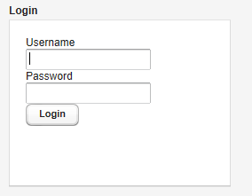
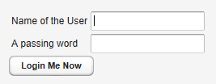

# UI 组件-LoginForm 组件

LoginForm 组件专门用来接受用户输入用户名和密码，并可以自动记住用户输入的用户名和密码。其基本用法如下：

```
// A wrapper with a caption for the login form
Panel loginPanel = new Panel("Login");
loginPanel.setWidth("250px");
        
LoginForm login = new LoginForm();
loginPanel.addComponent(login);
```



LoginForm 组件内部实现使用了 iframe 和静态 HTML 支持其功能。 如果你想定制 LoginForm 的外观可以重载 getLoginHtml()方法。
下面介绍如何定制 LoginForm 组件。

```
class MyLoginForm extends LoginForm {
    String usernameCaption;
    String passwordCaption;
    String submitCaption;
    
    public MyLoginForm(String usernameCaption,
            String passwordCaption, String submitCaption) {
        this.usernameCaption = usernameCaption;
        this.passwordCaption = passwordCaption;
        this.submitCaption  = submitCaption;
    }
```

然后重载 getLoginHTML()方法：
HTML body 部分包含 Form 定义，包含在一个 iframe 中。form 和 button 必需定义对应的javascripts 响应用户点击”submit’

```
@Override
protected byte[] getLoginHTML() {
    // Application URI needed for submitting form
    String appUri = getApplication().getURL().toString()
            + getWindow().getName() + "/";

    String x, h, b; // XML header, HTML head and body
	
	 x = "<!DOCTYPE html PUBLIC \"-//W3C//DTD "
      + "XHTML 1.0 Transitional//EN\" "
      + "\"http://www.w3.org/TR/xhtml1/"
      + "DTD/xhtml1-transitional.dtd\">\n";
	  
	   h = "<head><script type='text/javascript'>"
      + "var setTarget = function() {"
      + "  var uri = '" + appUri + "loginHandler';"
      + "  var f = document.getElementById('loginf');"
      + "  document.forms[0].action = uri;"
      + "  document.forms[0].username.focus();"
      + "};"
      + ""
      + "var styles = window.parent.document.styleSheets;"
      + "for(var j = 0; j < styles.length; j++) {\n"
      + "  if(styles[j].href) {"
      + "    var stylesheet = document.createElement('link');\n"
      + "    stylesheet.setAttribute('rel', 'stylesheet');\n"
      + "    stylesheet.setAttribute('type', 'text/css');\n"
      + "    stylesheet.setAttribute('href', styles[j].href);\n"
      + "    document.getElementsByTagName('head')[0]"
      + "                .appendChild(stylesheet);\n"
      + "  }"
      + "}\n"
      + "function submitOnEnter(e) {"
      + "  var keycode = e.keyCode || e.which;"
      + "  if (keycode == 13) {document.forms[0].submit();}"
      + "}\n"
      + "</script>"
      + "</head>";
	  
	   b = "<body onload='setTarget();'"
      + "  style='margin:0;padding:0; background:transparent;'"
      + "  class='"
      + ApplicationConnection.GENERATED_BODY_CLASSNAME + "'>"
      + "<div class='v-app v-app-loginpage'"
      + "     style='background:transparent;'>"
      + "<iframe name='logintarget' style='width:0;height:0;"
      + "border:0;margin:0;padding:0;'></iframe>"
      + "<form id='loginf' target='logintarget'"
      + "      onkeypress='submitOnEnter(event)'"
      + "      method='post'>"
      + "<table>"
      + "<tr><td>" + usernameCaption + "</td>"
      + "<td><input class='v-textfield' style='display:block;'"
      + "           type='text' name='username'></td></tr>"
      + "<tr><td>" + passwordCaption + "</td>"
      + "    <td><input class='v-textfield'"
      + "          style='display:block;' type='password'"
      + "          name='password'></td></tr>"
      + "</table>"
      + "<div>"
      + "<div onclick='document.forms[0].submit();'"
      + "     tabindex='0' class='v-button' role='button'>"
      + "<span class='v-button-wrap'>"
      + "<span class='v-button-caption'>"
      + submitCaption + "</span>"
      + "</span></div></div></form></div></body>";
	  
	    return (x + "<html>" + h + b + "</html>").getBytes();
}
```



Tags: [Java EE](http://www.imobilebbs.com/wordpress/archives/tag/java-ee), [Vaadin](http://www.imobilebbs.com/wordpress/archives/tag/vaadin), [Web](http://www.imobilebbs.com/wordpress/archives/tag/web)
