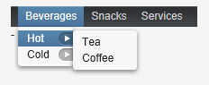

# MenuBar 组件

MenuBar 用来创建下拉菜单，类似桌面应用的菜单显示。
使用 MenuBar 首先创建 MenuBar 的实例：

```
// Create a menu bar
final MenuBar menubar = new MenuBar();
main.addComponent(menubar);
```

然后通过 addItem 为最上一级菜单添加菜单项，addItem 参数为 String，一个图标资源，一个Command 对象(用户点击菜单项后所执行命令）。 icon 和 command 可以为空。
Command 对象为实现了 MenuBar.Command 接口的对象，如：

```
// A feedback component
final Label selection = new Label("-");
main.addComponent(selection);

// Define a common menu command for all the menu items.
MenuBar.Command mycommand = new MenuBar.Command() {
    public void menuSelected(MenuItem selectedItem) {
        selection.setValue("Ordered a " +
                           selectedItem.getText() +
                           " from menu.");
    }  
};
```

addItem() 方法返回一个 MenuBar.MenuItem 对象，利用这个返回值，你可以参加子菜单。MenuItem 也有同样的 addItem 方法。

```
// Put some items in the menu hierarchically
MenuBar.MenuItem beverages =
    menubar.addItem("Beverages", null, null);
MenuBar.MenuItem hot_beverages =
    beverages.addItem("Hot", null, null);
hot_beverages.addItem("Tea", null, mycommand);
hot_beverages.addItem("Coffee", null, mycommand);
MenuBar.MenuItem cold_beverages =
    beverages.addItem("Cold", null, null);
cold_beverages.addItem("Milk", null, mycommand);

// Another top-level item
MenuBar.MenuItem snacks =
    menubar.addItem("Snacks", null, null);
snacks.addItem("Weisswurst", null, mycommand);
snacks.addItem("Salami", null, mycommand);

// Yet another top-level item
MenuBar.MenuItem services =
    menubar.addItem("Services", null, null);
services.addItem("Car Service", null, mycommand);
```

显示结果如下：



Tags: [Java EE](http://www.imobilebbs.com/wordpress/archives/tag/java-ee), [Vaadin](http://www.imobilebbs.com/wordpress/archives/tag/vaadin), [Web](http://www.imobilebbs.com/wordpress/archives/tag/web)