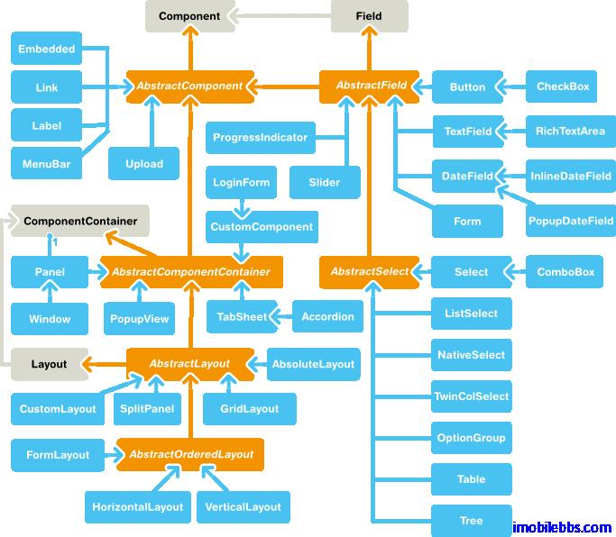
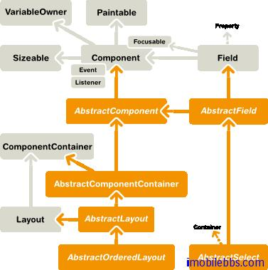
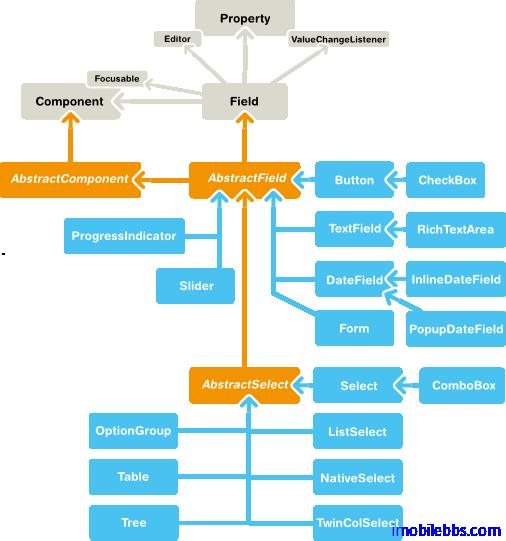

# UI 組件概述

和 Swing 一樣，Vaadin  也提供了大量的 UI 組件（控制項）給程序員用於定義用戶界面。下圖為Vaadin 中 UI 組件的類圖。



所用 UI 組件都實現 Component 介面，AbstractComponent 為所有 UI 組件的根類，它有兩個直接子類： AbstractField（實現 Field 介面），它提供了對數據綁定的支持。另外一個子類為AbstractComponentContainter，為所有容器類（Container）和布局類（Layout）的父類。對於一些不需要支持數據綁定的類，如 Label,Link 等直接由 AbstractComponent 派生。

布局（Layout）類用於管理其包含的其它 UI 組件的位置及大小。常見的布局有 GridLayout，VerticalLayout 等和 Swing 提供的非常類似。 此外 Vaadin 提供了一個 CustomLayout 組件，支持使用 XHTML 模板來描述用戶界面。

由上圖可以看到 Windows 類引用到 ComponentContainer，ComponentContainer 實現了 Layout介面。因此 Window 對象可以包含UI組件樹來顯示用戶界面。

Vaadin 庫內置了大量 UI 組件，此外很多 UI 組件可以以插件的形式添加到項目中，或者使用自定義的 UI 組件。

Vaadin UI 組件通過定義一些所用 UI 組件都支持的介面和抽象類實現UI組件通用的邏輯。以及這些 UI組件的狀態在 Client/Server 之間如何 serialized/deserialized.

下圖為 Component 的相關介面及抽象類之間的類關係圖：



所有 Component 都實現 Paintable 介面，這個介面用來把 UI 組件 serializing (「繪製」)到 客戶端。 而介面 VariableOwner 則為方向 deserializing UI 組件的狀態到伺服器端。

使用 UI 組件定義用戶界面，所涉及到的 UI 組件構成一個樹結構。可以通過 getParent() 取得某個UI 組件的父組件。 將一個 UI 組件添加到某個容器時將觸發 UI 組件的 attach() 方法，反之，移除某個 UI 組件時則觸發 detach() 方法。通常在 UI的 attach() 方法中獲取 UI 組件所需資源，例如：

```
public class AttachExample extends CustomComponent {
    public AttachExample() {
    }

    @Override
    public void attach() {
        super.attach(); // Must call.

        // Now we know who ultimately owns us.
        ClassResource r = new ClassResource("smiley.jpg",
                                            getApplication());
        Embedded image = new Embedded("Image:", r);
        setCompositionRoot(image);
    }
}
```

AbstractComponent 為所有 Component 的基類，它的 getTag 方法可以取得該 component 用於序列化的唯一標識符。

Field 組件 和某個值關聯，用戶可以修改這個值，比如 Text 組件的文字。下圖為 Field 組件的類關係圖：



Field 組件實現了 Field 介面以支持數據綁定。 可以使用 getValue, setValue 修改或獲取 Field 組件組件關聯的值。Field 組件具有下面屬性：

- description 所有 Field 組件都有說明域。
- required 當為真時，必填標識（一般為*)會顯示在對於的 UI 組件的左邊，上方（取決於對應的布局類）。如過 Field 組件必需有值而未提供時，此時 requiredError 不空時將顯示錯誤標識。
- requiredError  必填 Field 組件為空顯示個用戶的錯誤提示。   
Field 介面繼承 Property.ValueChangeListener 允許應用監控 UI 組件值的變化。

此外所用 Component 具有的屬性還有 Caption（標題），Tooltip（提示），Enabled，Icon，Locale，ReadOnly 等，在後面將有介紹。

Tags: [Java EE](http://www.imobilebbs.com/wordpress/archives/tag/java-ee), [Vaadin](http://www.imobilebbs.com/wordpress/archives/tag/vaadin), [Web](http://www.imobilebbs.com/wordpress/archives/tag/web)