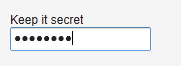

# UI 組件-PasswordField

PasswordField 為 TextField 的一個變種，主要用來獲取用戶密碼。

```
PasswordField tf = new PasswordField("Keep it secret");
```



Tags: [Java EE](http://www.imobilebbs.com/wordpress/archives/tag/java-ee), [Vaadin](http://www.imobilebbs.com/wordpress/archives/tag/vaadin), [Web](http://www.imobilebbs.com/wordpress/archives/tag/web)
