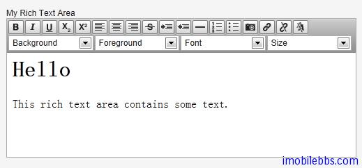
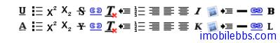

# UI 組件-RichTextArea

RichTextArea 允許輸入帶格式的文本。 RichTextArea 內容以 HTML 格式顯示。它繼承自TextArea，本身沒有提供什麼附加功能，你可以通過擴展 VRichTextArea, VRichTextToolbar 的方法來為 RichTextArea 添加客戶端功能。

```
// Create a rich text area
final RichTextArea rtarea = new RichTextArea();
rtarea.setCaption("My Rich Text Area");

// Set initial content as HTML
rtarea.setValue("<h1>Hello</h1>\n" +
    "<p>This rich text area contains some text.</p>");
```



可以看到 RichTextArea 控制項本身帶有一個工具條，其中的選擇框使用英語而不支持本地化，但你可以通過派生或重新定義 VRichTextToolbar 來實現本地化。 而工具條上按鈕可以通過 CSS 重新定義來實現本地化。
例如：

```
.v-richtextarea-richtextexample .gwt-ToggleButton
.gwt-Image {
background-image: url(img/richtextarea-toolbar-fi.png)
!important;
}
```

下圖為英語和本地化的 RichTextArea 工具條上按鈕。



Tags: [Java EE](http://www.imobilebbs.com/wordpress/archives/tag/java-ee), [Vaadin](http://www.imobilebbs.com/wordpress/archives/tag/vaadin), [Web](http://www.imobilebbs.com/wordpress/archives/tag/web)
