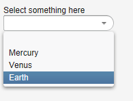
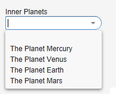
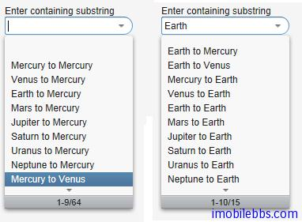
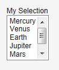
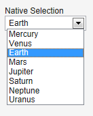
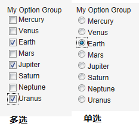
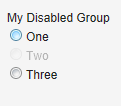
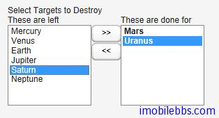

# UI组件-Select 组件

Vaadin 中提供了多种组件允许用户从多个选项中选择某个或多个选项。比如列表，下拉框，一组RadioButton 或 CheckBox，表格或 Tree 等。

下面为由 Vaddin 提供的核心选项组件，都是从基类 AbstractSelect 派生而来。

- Select 在单选模式时，提供一个文本框和一个下拉框，用户可以通过输入文字来筛选选项。在多选模式下等同 ListSelect。
- ComboBox 当选时为一下拉框选择。否则等同 Select，但可以允许用户输入新的选项。
- ListSelect 垂直下拉框选项支持单选和多选。
- NativeSelect 使用由浏览器提供的选择框，通常为一下拉框控件，支持单选和多选。实际为为 HTML 中的 select 元素。
- OptionGroup 单选时使用 RadioButton, 多选时使用 CheckButton 的垂直选项组。
- TwinColSelect 并列显示两个列表，用户可以选取其中一个列表中可选项，移动到另外一个列表中。
除此之外，Vaddin 也提供 Tree 和 Table 组件用于选择，它们也都是由 AbstractSelect 继承而来，将在后续文章中单独介绍。

## 绑定数据

Vaadin 的选项组件与 Vaadin 的数据模型关系密切。选项组件中每个可选项都实现 Item 接口，并包含在 Container 对象中，当前选中项绑定到一个 Property 接口对象。

Vaadin 的数据绑定模型 Item, Container, Property 就在后面详细介绍，对于 Select 组件来说，它们都和一个缺省的 Container 类型绑定，而无需自己重新定义实现一个 Container。

Container 接口中的 addItem() 用来添加一个选择项：

```
// Create a selection component
Select select = new Select ("Select something here");

// Add some items and give each an item ID
select.addItem("Mercury");
select.addItem("Venus");
select.addItem("Earth");
```



addItem() 创建一个新的 Item 对象，这个 Item 对象由唯一的 Item 表示符(IID)指定,通常这个IID 也是这个选择项的标题，为一字符串类型。
但 IID 实际可以为任何对象类型。我们可以为某个 Item 指定整数型 IID，再使用 setItemCaption为这个 Item 指定标题显示。
使用不带参数的 addItem() 返回自动生成的 IID。

```
// Create a selection component
Select select = new Select("My Select");

// Add an item with a generated ID
Object itemId = select.addItem();
select.setItemCaption(itemId, "The Sun");

// Select the item
select.setValue(itemId);
```

对于其它类型的 Container，比如 BeanItemContainer 可以使用该 Container 自己的方法如addBean 添加一个选择项。
选项的标题的显示有多种模式，可以使用 setItemCaption 明确指定，也可以使用 IID 做为标题或者图标等，
标题的模式通过方法 setItemCaptionMode 来指定。可以有
ITEM_CAPTION_MODE_EXPLICIT_DEFAULTS_ID    
ITEM_CAPTION_MODE_EXPLICIT     
ITEM_CAPTION_MODE_ICON_ONLY     
ITEM_CAPTION_MODE_ID    
ITEM_CAPTION_MODE_INDEX    
ITEM_CAPTION_MODE_ITEM    
ITEM_CAPTION_MODE_PROPERTY    
这里就不一一说明。 举例如下：



前面提过 Select 组件的当前选中的项和一个 Property 对象绑定，可以使用 Property 的getValue 来获取当前选项的值。同样可以使用 setValue 来指定当前选取项。

下面逐个介绍下每个 Select 组件的用法：

Select 组件 支持选择筛选，用户可以通过输入的文字作为筛选的条件，Select 列表筛选出符合条件的列表项帮助用户快速选择。 它支持两种筛选模式，一为 FILTERINGMODE_CONTAINS  选择所有包含输入文字的列表项，另一为 FILTERINGMODE_STARTSWITH  匹配所有有输入文字开头的列表项。如下列：

```
Select select = new Select("Enter containing substring");

select.setFilteringMode(AbstractSelect.Filtering.FILTERINGMODE_CONTAINS);

/* Fill the component with some items. */
final String[] planets = new String[] {
		"Mercury", "Venus", "Earth", "Mars",
		"Jupiter", "Saturn", "Uranus", "Neptune" };

for (int i = 0; i < planets.length; i++)
	for (int j = 0; j < planets.length; j++) {
		select.addItem(planets[j] + " to " + planets[i]);
	}
```



ListSelect 组件 为一垂直下拉框，当列表项过多时自动显示垂直滚动条。setMultiSelect 用来设置单选或多选.

```
// Create the selection component
ListSelect select = new ListSelect("My Selection");

// Add some items
select.addItem("Mercury");
select.addItem("Venus");
select.addItem("Earth");
...

select.setNullSelectionAllowed(false);

// Show 5 items and a scrollbar if there are more
select.setRows(5);
```



NativeSelect 使用浏览器支持的 HTML select 元素显示列表：

```
// Create the selection component
final NativeSelect select = new NativeSelect("Native Selection");

// Add some items
select.addItem("Mercury");
select.addItem("Venus");
select.addItem("Earth");
select.addItem("Mars");
select.addItem("Jupiter");
select.addItem("Saturn");
select.addItem("Neptune");
select.addItem("Uranus");

// Set the width in "columns" as in TextField
select.setColumns(10);

select.setNullSelectionAllowed(false);
```



OptionGroup 支持 RadioButton 和 CheckButton 用于单选和多选。

```
OptionGroup group = new OptionGroup("My Option Group");

// Add some items
group.addItem("Mercury");
group.addItem("Venus");
group.addItem("Earth");
group.addItem("Mars");
group.addItem("Jupiter");
group.addItem("Saturn");
group.addItem("Neptune");
group.addItem("Uranus");

// Use the multiple selection mode.
group.setMultiSelect(true);
```



可以使用 setItemEnabled()来 Enable 或 Disable 列表中的某个选项。

```
// Have an option group
OptionGroup group = new OptionGroup("My Disabled Group");
group.addItem("One");
group.addItem("Two");
group.addItem("Three");

// Disable one item
group.setItemEnabled("Two", false);
```



TwinColSelect 组件并列显示两个列表，总是多选模式，因此它当前选项对应的 Property 对象一定是个集合对象(Collection).

```
final TwinColSelect select =
    new TwinColSelect("Select Targets to Destroy");

// Set the column captions (optional)
select.setLeftColumnCaption("These are left");
select.setRightColumnCaption("These are done for");

// Put some data in the select
String planets[] = {"Mercury", "Venus", "Earth", "Mars",
        "Jupiter", "Saturn", "Uranus", "Neptune"};
for (int pl=0; pl<planets.length; pl++)
    select.addItem(planets1);

// Set the number of visible items
select.setRows(planets.length);
```



Tags: [Java EE](http://www.imobilebbs.com/wordpress/archives/tag/java-ee), [Vaadin](http://www.imobilebbs.com/wordpress/archives/tag/vaadin), [Web](http://www.imobilebbs.com/wordpress/archives/tag/web)
