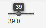

# UI 组件-Slider 组件

Slider 组件可以显示为垂直或是水平滑动条，可以使用鼠标拖动来设置其值。 其基本使用如下：

```
// Create a vertical slider
final Slider vertslider = new Slider(1, 100);
vertslider.setOrientation(Slider.ORIENTATION_HORIZONTAL);


// Shows the value of the vertical slider
final Label vertvalue = new Label();
vertvalue.setSizeUndefined();

// Handle changes in slider value.
vertslider.addListener(new Property.ValueChangeListener() {

	public void valueChange(
			com.vaadin.data.Property.ValueChangeEvent event) {
		 double value = (Double) vertslider.getValue();

		vertvalue.setValue(String.valueOf(value));
		
	}
});
 
// The slider has to be immediate to send the changes
// immediately after the user drags the handle.
vertslider.setImmediate(true);
```



Slider 组件也属于 Field 组件，因此可以通过 ValueChangeListener 来监听 Slider 组件值的变化。同样可以使用 setValue 来修改 Slider 组件的值，此时要注意 Catch 可能的ValueOutOfBoundsException。

```
// Set the initial value. This has to be set after the
// listener is added if we want the listener to handle
// also this value change.
try {
 vertslider.setValue(50.0);
} catch (ValueOutOfBoundsException e) {
}
```

Tags: [Java EE](http://www.imobilebbs.com/wordpress/archives/tag/java-ee), [Vaadin](http://www.imobilebbs.com/wordpress/archives/tag/vaadin), [Web](http://www.imobilebbs.com/wordpress/archives/tag/web)