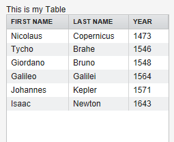
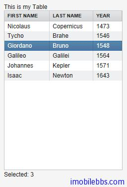
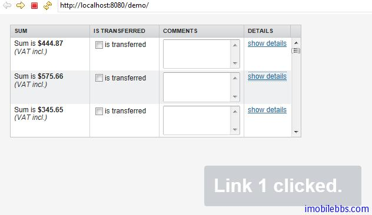
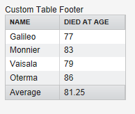

# UI 组件-Table 组件

Table 用来显示一个二维表，Table 算是 Vaadin 提供的功能最强大的组件，每个单元格既可以显示字符串也可以显示其它的 UI 组件。你可以实现可编辑的表格，比如点击某个单元格后将其变为可编辑的文本框。
Table 关联的数据采用 Vaadin 的 Container 数据模型。从而使得 Table 可以直接绑定数据库的表或查询。Table 只载入当前需要显示的数据，当数据载入时，Table 会给出提示正在显示的数据表的范围和全部记录的数目。
Table 中每行数据对应 Vaadin 数据模型的 Item 接口 ，每个字段对应到 Property 接口，每行数据由 Item 标识符（IID）唯一指定，而字段由 Property 标识符（PID）指定。
创建一个 Table，首先使用 addContainerProperty 定义表的字段。这个方法有两种调用方式。简单方式是使用 Property ID 做为字段的标题。而复杂方式可以分别制定 Property ID 和字段的标题，这种方式使得应用本地化成为可能。
复杂方式也支持使用图标资源显示字段标题。在定义表的字段时，可以提供一个“缺省值”用在该字段没有赋值的情况下。Table 基本用法如下：

```
// Create the table with a caption. 
Table table = new Table("This is my Table");

// Define the names and data types of columns.
// The "default value" parameter is meaningless here. 
table.addContainerProperty("First Name", String.class,  null);
table.addContainerProperty("Last Name",  String.class,  null);
table.addContainerProperty("Year",       Integer.class, null);

// Add a few items in the table. 
table.addItem(new Object[] {
    "Nicolaus","Copernicus",new Integer(1473)}, new Integer(1));
table.addItem(new Object[] {
    "Tycho",   "Brahe",     new Integer(1546)}, new Integer(2));
table.addItem(new Object[] {
    "Giordano","Bruno",     new Integer(1548)}, new Integer(3));
table.addItem(new Object[] {
    "Galileo", "Galilei",   new Integer(1564)}, new Integer(4));
table.addItem(new Object[] {
    "Johannes","Kepler",    new Integer(1571)}, new Integer(5));
table.addItem(new Object[] {
    "Isaac",   "Newton",    new Integer(1643)}, new Integer(6));
```

在这个例子中，使用了整数值作为 Item 的 IID，作为第二个参数传给 addItem, 每行实际的数据为一个 Object 数组，采用和表字段定义同样的顺序，并且必须采用和由 addContainerProperty 定义的同样的数据类型。



Table 支持的数据规模取决于 Container 的实现，缺省的 Container 在更新数据时可能会由于数据规模过大而造成问题。因此推荐使用优化过的 Container 类型。Table 本身不限制记录的数目，但当前滚动实现有一个50万条记录的限制。

选择 Table 中的项 ，Table 允许用户选择表格中的某个或多个数据项，当用户选取某个 Item 时，Item 的 IID 会作为 ValueChangeEvent 的 Property 传入。要使 Table 支持选取，必须通过方法 setSelectable 将 Table 设为支持选取。同时需将 setImmediate 设为 True。

例如：

```
// Allow selecting items from the table.
table.setSelectable(true);

// Send changes in selection immediately to server.
table.setImmediate(true);

// Shows feedback from selection.
final Label current = new Label("Selected: -");

// Handle selection change.
table.addListener(new Property.ValueChangeListener() {
    public void valueChange(ValueChangeEvent event) {
        current.setValue("Selected: " + table.getValue());
    }
});
```



通常用户再次点击已选取的数据行时会取消该行的选取，如果你想修改这种行为，可以将setNullSelectionAllowed 设为 False.
如果需要 Table 支持多行选取，可以将 setMultiSelect 设为 True, 此时可以通过按下 Ctrl/Shift 来实现多选。

Table 缺省支持滚动条，当所显示记录数大于 Table 可见行数时在 Table 右边显示滚动条。可以通过setPageLength 修改 Table 可以区域。将 PageLength 设为0，取消分页，显示所有记录数。
表个字段宽度可以通过 setColumnWidth 来修改，用户也可以通过拖动字段边界更改字段宽度，并会触发 ColumnResizeEvent 事件。
如果设置 setColumnReorderingAllowed(true) ，则允许用户重新排列字段的顺序。
setColumnCollapsingAllowed (true) 允许用户展开或隐藏某些字段。
以上 Table 单元格中都显示的是简单的字符串，Table 单元格也可以显示 UI 组件。此时如果 Table缺省风格的行高不够的话，你需要使用自定义的风格定义合适的行高。
如果需要响应 Table 单元格中某个 UI 组件的事件，需要知道其对应的 Item 标识 IID。简单的方法是使用 setData 方法将某个对象附加到该 UI 组件上。
如下例使用了 Label，TextField, CheckBox, Button 作为 Table 单元格元素显示。

```
// Create a table and add a style to allow setting the row height in theme.
final Table table = new Table();
table.addStyleName("components-inside");

//Define the names and data types of columns.
// The "default value" parameter is meaningless here. 
table.addContainerProperty("Sum",            Label.class,     null);
table.addContainerProperty("Is Transferred", CheckBox.class,  null);
table.addContainerProperty("Comments",       TextField.class, null);
table.addContainerProperty("Details",        Button.class,    null);

// Add a few items in the table. 
for (int i=0; i<100; i++) {
    // Create the fields for the current table row
    Label sumField = new Label(String.format(
                   "Sum is <b>$%04.2f</b><br/><i>(VAT incl.)</i>",
                   new Object[] {new Double(Math.random()*1000)}),
                               Label.CONTENT_XHTML);
    CheckBox transferredField = new CheckBox("is transferred");

    // Multiline text field. This required modifying the
    // height of the table row.
    TextField commentsField = new TextField();
    commentsField.setRows(3);

    // The Table item identifier for the row.
    Integer itemId = new Integer(i);

    // Create a button and handle its click. A Button does not
    // know the item it is contained in, so we have to store the
    // item ID as user-defined data.
    Button detailsField = new Button("show details");
    detailsField.setData(itemId);
    detailsField.addListener(new Button.ClickListener() {
        public void buttonClick(ClickEvent event) {
            // Get the item identifier from the user-defined data.
            Integer itemId = (Integer)event.getButton().getData();
            getWindow().showNotification("Link "+
                                   itemId.intValue()+" clicked.");
        }
    });
    detailsField.addStyleName("link");

    // Create the table row.
    table.addItem(new Object[] {sumField, transferredField,
                                commentsField, detailsField},
                  itemId);
}

// Show just three rows because they are so high.
table.setPageLength(3);
```



通常情况下 Table 以文本形式显示单元格，如果想让 Table 支持编辑功能，一是使用上面 UI 组件的方式，或者简单的调用 setEditable(true)自动将表格变为可编辑。
setColumnHeader 为表格定义表头，setColumnFooter 定义表尾。Table 的表头和表尾也接受点击事件。
下例显示了一个自定义的表尾显示平均值。

```
// Have a table with a numeric column
Table table = new Table("Custom Table Footer");
table.addContainerProperty("Name", String.class, null);
table.addContainerProperty("Died At Age", Integer.class, null);

// Insert some data
Object people[][] = {{"Galileo",  77},
                     {"Monnier",  83},
                     {"Vaisala",  79},
                     {"Oterma",   86}};
for (int i=0; i<people.length; i++)
    table.addItem(people[i], new Integer(i));

// Calculate the average of the numeric column
double avgAge = 0;
for (int i=0; i<people.length; i++)
    avgAge += (Integer) people[i][1];
avgAge /= people.length;

// Set the footers
table.setFooterVisible(true);
table.setColumnFooter("Name", "Average");
table.setColumnFooter("Died At Age", String.valueOf(avgAge));

// Adjust the table height a bit
table.setPageLength(table.size());
```



以上介绍了 Table 的基本用法，表格的用法远不止这些，比如可以通过 ColumnGenerator 通过计算从其它字段生成某个字段或者希望格式化字段等等这里就不在一一介绍，具体可以参考 Vaadin 开发文档。

Tags: [Java EE](http://www.imobilebbs.com/wordpress/archives/tag/java-ee), [Vaadin](http://www.imobilebbs.com/wordpress/archives/tag/vaadin), [Web](http://www.imobilebbs.com/wordpress/archives/tag/web)
