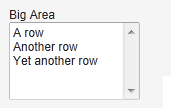
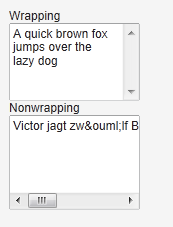

# UI 組件-TextArea

前面 TextField 一般為單行顯示，而 TextArea 為多行顯示。基本用法如下：

```
/ Create the area
TextArea area = new TextArea("Big Area");

// Put some content in it
area.setValue("A row\n"+
              "Another row\n"+
              "Yet another row");
```



setRows() 定義 TextArea 的行數。 setHeight() 定義其高度，如過顯示的內容超過其行數，則自動出現垂直滾動條。
setWordwrap() 用於控制自動換行。預設為 true。如果為假，如果顯示文字過寬，則出現水平滾動條。



Tags: [Java EE](http://www.imobilebbs.com/wordpress/archives/tag/java-ee), [Vaadin](http://www.imobilebbs.com/wordpress/archives/tag/vaadin), [Web](http://www.imobilebbs.com/wordpress/archives/tag/web)
