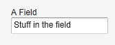
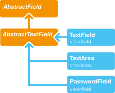
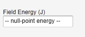

# UI 組件-TextField

TextField 文本框，可以接受用戶輸入文字。它實現 Field 介面，支持數據綁定。基本用法：

```
// Create a text field
TextField tf = new TextField("A Field");
// Put some initial content in it
tf.setValue("Stuff in the field");
```

顯示如下：



支持 Field 介面的 UI 組件，可以通過 Property.ValueChangeListener 來監視 Value 的變化。可以通過方法 getValue()來取代 TextField 的當前值。參考下面代碼片段：

```
// Handle changes in the value
tf.addListener(new Property.ValueChangeListener() {
    public void valueChange(ValueChangeEvent event) {
        // Assuming that the value type is a String
        String value = (String) tf.getValue();

        // Do something with the value
        getWindow().showNotification("Value is:", value);
    }
});

// Fire value changes immediately when the field loses focus
tf.setImmediate(true);
```

TextField 由 AbstractTextField 派生而來，因此繼承了 AbstractTextField 的大部分 API。下圖為 AbstractTextField 的類關係圖：



## 數據綁定

實現 Field 介面的 UI 組件支持數據綁定，TextField 可以綁定到支持和 String 互換的數據類型。比如下面代碼將 TextField 綁定到一個 Double 數據變數。

```
// Have an initial data model. As Double is unmodificable and
// doesn't support assignment from String, the object is
// reconstructed in the wrapper when the value is changed.
Double trouble = 42.0;

// Wrap it in a property data source
final ObjectProperty<Double> property =
    new ObjectProperty<Double>(trouble);

// Create a text field bound to it
TextField tf = new TextField("The Answer", property);
tf.setImmediate(true);

// Show that the value is really written back to the
// data source when edited by user.
Label feedback = new Label(property);
feedback.setCaption("The Value");
```

## 字元串長度

可以通過 setMaxLenght() 指定文本框可以輸入的字元串長度。為安全起見，TextField 的值傳到伺服器端時會截去超過最大長都的部分。

## 處理 Null 值

TextField 可以綁定到某些支持 Null 值的數據源，如資料庫的某個欄位。此時，你可能想以某種特殊方式表示 Null 值，可以通過 setNullRepresentation() 設置但當數據源為 Null 時顯示內容。 setNullSettingAllowed 可以控制是否允許用客輸入 null 值，當 setNullSettingAllowed 為假時，輸入的 Null 代表字元串 null，而非 Null 值。

比如：

```
// Create a text field without setting its value
TextField tf = new TextField("Field Energy (J)");
tf.setNullRepresentation("-- null-point energy --");

// The null value is actually the default
tf.setValue(null);

// Allow user to input the null value by
// its representation
tf.setNullSettingAllowed(true);

// Feedback to see the value
Label value = new Label(tf);
value.setCaption("Current Value:");
```

結果如下：



## Text 文本變化事件
除了通用的 Property.ValueChangeListener 之外，TextField 可以使用 TextChangeListner 來監視 Text 內容的變化。immediate 模式實際上並非是立即觸發 Text 內容變化事件，而是發生在TextField 失去 Focus 後。
TextField 文本變化事件觸發的時機有三種模式：TextChangeEventMode.LAZY (預設模式），TextChangeEventMode.TIMEOUT 和 TextChangeEventMode.EAGER 。
TextChangeEventMode.EAGER 表示每次按鍵都會觸發事件，而 TextChangeEventMode.TIMEOUT  表示每隔指定時間段時觸發事件，而 TextChangeEventMode.LAZY 則表示在輸入暫停的某個時刻觸發事件。
對於 Web 應用來說，使用預設模式可以適用大部分情況。

Tags: [Java EE](http://www.imobilebbs.com/wordpress/archives/tag/java-ee), [Vaadin](http://www.imobilebbs.com/wordpress/archives/tag/vaadin), [Web](http://www.imobilebbs.com/wordpress/archives/tag/web)