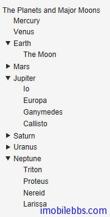
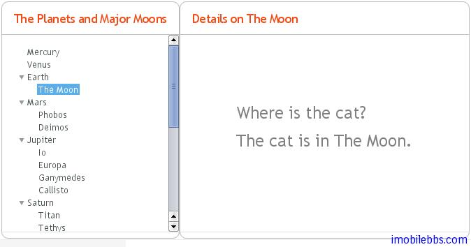

# UI 组件-Tree 组件

Tree 组件可以用来显示具有层次关系的数据源，比如文件系统。Tree 组件的一个典型应用是作为菜单显示。

```
final Object[][] planets = new Object[][]{
        new Object[]{"Mercury"},
        new Object[]{"Venus"},
        new Object[]{"Earth", "The Moon"},
        new Object[]{"Mars", "Phobos", "Deimos"},
        new Object[]{"Jupiter", "Io", "Europa", "Ganymedes",
                                "Callisto"},
        new Object[]{"Saturn",  "Titan", "Tethys", "Dione",
                                "Rhea", "Iapetus"},
        new Object[]{"Uranus",  "Miranda", "Ariel", "Umbriel",
                                "Titania", "Oberon"},
        new Object[]{"Neptune", "Triton", "Proteus", "Nereid",
                                "Larissa"}};

Tree tree = new Tree("The Planets and Major Moons");

// Add planets as root items in the tree.
for (int i=0; i    String planet = (String) (planets[i][0]);
    tree.addItem(planet);

    if (planets[i].length == 1) {
        // The planet has no moons so make it a leaf.
        tree.setChildrenAllowed(planet, false);
    } else {
        // Add children (moons) under the planets.
        for (int j=1; j            String moon = (String) planets[i][j];

            // Add the item as a regular item.
            tree.addItem(moon);

            // Set it to be a child.
            tree.setParent(moon, planet);

            // Make the moons look like leaves.
            tree.setChildrenAllowed(moon, false);
        }

        // Expand the subtree.
        tree.expandItemsRecursively(planet);
    }
}

main.addComponent(tree);
```



当然你可以选择合适的 Menu 风格使得 Tree 看起来更像菜单，比如：



注：到这里你可能注意到到目前为止在介绍 UI 组件时文章都避免涉及 CSS，Theme 应用，这是为的使Vaadin 应用开发更像开发桌面应用，后面会集中介绍主题的使用，对于一般应用你可以使用缺省主题。

同 Field 组件一样，你可以使用 getValue,setValue 设置或取得 Tree 组件当前选中的 Item 项。Tree 组件对应的 Container 类型为 HierarchicalContainer.

Tags: [Java EE](http://www.imobilebbs.com/wordpress/archives/tag/java-ee), [Vaadin](http://www.imobilebbs.com/wordpress/archives/tag/vaadin), [Web](http://www.imobilebbs.com/wordpress/archives/tag/web)