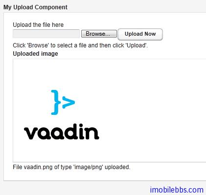

# UI 组件-Upload 组件

Upload 组件用于向服务器上传文件。它显示一个文件名输入框，一个文件选择按钮和一个上传确认按钮。

```
// Create the Upload component.
Upload upload = new Upload("Upload the file here", this);
```


可以通过 setButtonCaption 修改”Upload” 按钮的文字。对于”Browser” 按钮由于浏览器安全方面的考虑，难以修改它的外观，”Brower” 显示语言取决于浏览器本身。 因此如果你想保持”Upload” 语言显示的一致，你必须使用和“Browser”一样的语言。
通常情况上传的文件可以存放在文件系统，数据库或是临时存放在内存中，Upload 组件将上传的文件数据写到一个 java.io.OutputStream 对象中，因此你可以使用你喜欢的方法来处理上传到服务器的文件。
使用 Upload 组件，需要实现 Upload.Receiver 接口来处理文件数据，它将在用户点击”upload”按钮后调用。
当文件上传结束后，成功与否 Upload 组件将触发 Upload.FinishedEvent 事件。可以通过Upload.FinishedListener 接口来处理这个事件，事件参数包括文件名,MIME 类型和文件长度。
下面的例子将上传的图像文件存放在/tmp/uploads 目录下 并显示最后上传的图像。

```
import java.io.File;
import java.io.FileOutputStream;
import java.io.OutputStream;
import com.vaadin.terminal.FileResource;
import com.vaadin.ui.*;

public class MyUploader extends CustomComponent
                        implements Upload.SucceededListener,
                                   Upload.FailedListener,
                                   Upload.Receiver {

    Panel root;         // Root element for contained components.
    Panel imagePanel;   // Panel that contains the uploaded image.
    File  file;         // File to write to.

    MyUploader() {
        root = new Panel("My Upload Component");
        setCompositionRoot(root);

        // Create the Upload component.
        final Upload upload =
                new Upload("Upload the file here", this);

        // Use a custom button caption instead of plain "Upload".
        upload.setButtonCaption("Upload Now");

        // Listen for events regarding the success of upload.
        upload.addListener((Upload.SucceededListener) this);
        upload.addListener((Upload.FailedListener) this);

        root.addComponent(upload);
        root.addComponent(new Label("Click 'Browse' to "+
                "select a file and then click 'Upload'."));

        // Create a panel for displaying the uploaded image.
        imagePanel = new Panel("Uploaded image");
        imagePanel.addComponent(
                         new Label("No image uploaded yet"));
        root.addComponent(imagePanel);
    }

    // Callback method to begin receiving the upload.
    public OutputStream receiveUpload(String filename,
                                      String MIMEType) {
        FileOutputStream fos = null; // Output stream to write to
        file = new File("/tmp/uploads/" + filename);
        try {
            // Open the file for writing.
            fos = new FileOutputStream(file);
        } catch (final java.io.FileNotFoundException e) {
            // Error while opening the file. Not reported here.
            e.printStackTrace();
            return null;
        }

        return fos; // Return the output stream to write to
    }

    // This is called if the upload is finished.
    public void uploadSucceeded(Upload.SucceededEvent event) {
        // Log the upload on screen.
        root.addComponent(new Label("File " + event.getFilename()
                + " of type '" + event.getMIMEType()
                + "' uploaded."));
        
        // Display the uploaded file in the image panel.
        final FileResource imageResource =
                new FileResource(file, getApplication());
        imagePanel.removeAllComponents();
        imagePanel.addComponent(new Embedded("", imageResource));
    }

    // This is called if the upload fails.
    public void uploadFailed(Upload.FailedEvent event) {
        // Log the failure on screen.
        root.addComponent(new Label("Uploading "
                + event.getFilename() + " of type '"
                + event.getMIMEType() + "' failed."));
    }
}
```



Tags: [Java EE](http://www.imobilebbs.com/wordpress/archives/tag/java-ee), [Vaadin](http://www.imobilebbs.com/wordpress/archives/tag/vaadin), [Web](http://www.imobilebbs.com/wordpress/archives/tag/web)

