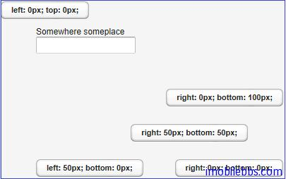
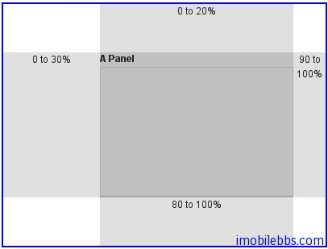

# UI 布局-AbsoluteLayout 布局

AbsoluteLayout 布局允许将其中的UI组件任意指定其位置。方法 addComponent()可以指定相对于AbsoluteLayout 边界的纵横坐标。还可以指定一个Z方向深度值，用来表示 UI 组件的前后顺序。
UI 组件的位置是通过 left,right,top,bottom 及 z-index 来指定（CSS对应的属性）。

```
// A 400x250 pixels size layout
AbsoluteLayout layout = new AbsoluteLayout();
layout.setWidth("400px");
layout.setHeight("250px");
        
// A component with coordinates for its top-left corner
TextField text = new TextField("Somewhere someplace");
layout.addComponent(text, "left: 50px; top: 50px;");

// At the top-left corner
Button button = new Button( "left: 0px; top: 0px;");
layout.addComponent(button, "left: 0px; top: 0px;");
 
// At the bottom-right corner
Button buttCorner = new Button( "right: 0px; bottom: 0px;");
layout.addComponent(buttCorner, "right: 0px; bottom: 0px;");
 
// Relative to the bottom-right corner
Button buttBrRelative = new Button( "right: 50px; bottom: 50px;");
layout.addComponent(buttBrRelative, "right: 50px; bottom: 50px;");
 
// On the bottom, relative to the left side
Button buttBottom = new Button( "left: 50px; bottom: 0px;");
layout.addComponent(buttBottom, "left: 50px; bottom: 0px;");
 
// On the right side, up from the bottom
Button buttRight = new Button( "right: 0px; bottom: 100px;");
layout.addComponent(buttRight, "right: 0px; bottom: 100px;");
```



除了使用 px 指定据边界的距离外，也可以使用百分比。

```
// A panel that takes 30% to 90% horizontally and
// 20% to 80% vertically
Panel panel = new Panel("A Panel");
panel.setSizeFull(); // Fill the specified area
layout.addComponent(panel, "left: 30%; right: 10%;" +
                           "top: 20%; bottom: 20%;");
```



Tags: [Java EE](http://www.imobilebbs.com/wordpress/archives/tag/java-ee), [Vaadin](http://www.imobilebbs.com/wordpress/archives/tag/vaadin), [Web](http://www.imobilebbs.com/wordpress/archives/tag/web)