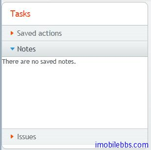

# UI 布局-Accordion 布局

Accordion 布局类似 TabSheet，不过是以垂直方式安排多个标签页，其使用方法也和 TabSheet 布局类似。

```
// Create the Accordion.
Accordion accordion = new Accordion();
 
// Have it take all space available in the layout.
accordion.setSizeFull();
 
// Some components to put in the Accordion.
Label l1 = new Label("There are no previously saved actions.");
Label l2 = new Label("There are no saved notes.");
Label l3 = new Label("There are currently no issues.");
 
// Add the components as tabs in the Accordion.
accordion.addTab(l1, "Saved actions", null);
accordion.addTab(l2, "Notes", null);
accordion.addTab(l3, "Issues", null);
 
// A container for the Accordion.
Panel panel = new Panel("Tasks");
panel.setWidth("300px");
panel.setHeight("300px");
panel.addComponent(accordion);
 
// Trim its layout to allow the Accordion take all space.
panel.getLayout().setSizeFull();
panel.getLayout().setMargin(false);
```



Tags: [Java EE](http://www.imobilebbs.com/wordpress/archives/tag/java-ee), [Vaadin](http://www.imobilebbs.com/wordpress/archives/tag/vaadin), [Web](http://www.imobilebbs.com/wordpress/archives/tag/web)