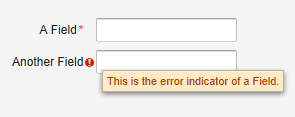

# UI 布局-FormLayout 布局

FormLayout 布局為使用表單（Form）時的預設布局方式。它通常將 Field 組件的標題和輸入域並排以兩列的方式顯示，並可以顯示可選的必填標識。在用戶輸入錯誤時顯示錯誤提示。
Form 本身可以有標題，錯誤提示，表單章節附註等，具體參見[Vaadin Web 應用開發教程(23):UI 組件-Form 組件](http://www.imobilebbs.com/wordpress/?m=20120811)

FormLayout 布局的基本用法如下：

```
// A FormLayout used outside the context of a Form
FormLayout fl = new FormLayout();

// Make the FormLayout shrink to its contents 
fl.setSizeUndefined();

TextField tf = new TextField("A Field");
fl.addComponent(tf);

// Mark the first field as required
tf.setRequired(true);
tf.setRequiredError("The Field may not be empty.");

TextField tf2 = new TextField("Another Field");
fl.addComponent(tf2);

// Set the second field straing to error state with a message.
tf2.setComponentError(
    new UserError("This is the error indicator of a Field."));
```

顯示如下：



Tags: [Java EE](http://www.imobilebbs.com/wordpress/archives/tag/java-ee), [Vaadin](http://www.imobilebbs.com/wordpress/archives/tag/vaadin), [Web](http://www.imobilebbs.com/wordpress/archives/tag/web)
