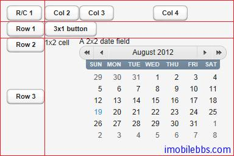
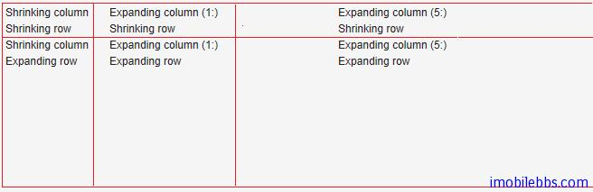

#UI 布局-GridLayout 布局

GridLayout 布局使用网格来布置其中的 UI 组件。每个网格提供行，列来定义。每个 UI 组件可以占据一个或多个网格。由网格的坐标(x1,y1,x2,y2)来定义。
GridLayout 布局内部使用一个游标(cursor)来记录当前的网格位置，GridLayout 布局添加 UI 组件的顺序为从左到右，从上到下。如果游标越过当前网格的右下角，GridLayout 布局自动添加一行。
下例为 GridLayout 布局的基本用法，addComponent 第一个参数为所添加的 UI 组件对象，第二个参数可选，指定 UI 组件添加的网格坐标。可以使用单个坐标或是一个区域。网格坐标从0开始。

```
// Create a 4 by 4 grid layout.
GridLayout grid = new GridLayout(4, 4);
grid.addStyleName("example-gridlayout");

// Fill out the first row using the cursor.
grid.addComponent(new Button("R/C 1"));
for (int i = 0; i < 3; i++) {
    grid.addComponent(new Button("Col " + (grid.getCursorX() + 1)));
}

// Fill out the first column using coordinates.
for (int i = 1; i < 4; i++) {
    grid.addComponent(new Button("Row " + i), 0, i);
}
 
// Add some components of various shapes.
grid.addComponent(new Button("3x1 button"), 1, 1, 3, 1);
grid.addComponent(new Label("1x2 cell"), 1, 2, 1, 3);
InlineDateField date = new InlineDateField("A 2x2 date field");
date.setResolution(DateField.RESOLUTION_DAY);
grid.addComponent(date, 2, 2, 3, 3);
```



GridLayout 布局缺省使用“未定义”宽度和高度，因此缺省自适应其所包含的 UI 组件。如果使用指定大小或是比例，其可使用的选项类同[Vaadin Web应用开发教程(29):UI布局-VerticalLayout和HorizontalLayout布局](http://www.imobilebbs.com/wordpress/?p=3367)

类似 VerticalLayout 和 HorizontalLayout 布局也可以为 UI 组件指定扩展比例，让某些 UI 组件占据 GridLayout 布局剩余空间。可以通过 setRowExpandRatio()和 setColumnExpandRatio()为行和列分别制定扩展（权重）比例。第一个参数为行或列的坐标，第二个参数为权重。
如下例：

```
GridLayout grid = new GridLayout(3,2);

// Layout containing relatively sized components must have
// a defined size, here is fixed size.
grid.setWidth("600px");
grid.setHeight("200px");

// Add some content
String labels [] = {
        "Shrinking column<br/>Shrinking row",
        "Expanding column (1:)<br/>Shrinking row",
        "Expanding column (5:)<br/>Shrinking row",
        "Shrinking column<br/>Expanding row",
        "Expanding column (1:)<br/>Expanding row",
        "Expanding column (5:)<br/>Expanding row"
};
for (int i=0; i<labels.length; i++) {
    Label label = new Label(labels[i], Label.CONTENT_XHTML);
    label.setWidth(null); // Set width as undefined
    grid.addComponent(label);
}

// Set different expansion ratios for the two columns
grid.setColumnExpandRatio(1, 1);
grid.setColumnExpandRatio(2, 5);

// Set the bottom row to expand
grid.setRowExpandRatio(1, 1);

// Align and size the labels.
for (int col=0; col<grid.getColumns(); col++) {
    for (int row=0; row<grid.getRows(); row++) {
        Component c = grid.getComponent(col, row);
        grid.setComponentAlignment(c, Alignment.TOP_CENTER);
        
        // Make the labels high to illustrate the empty
        // horizontal space.
        if (col != 0 || row != 0)
            c.setHeight("100%");
    }
}
```



Tags: [Java EE](http://www.imobilebbs.com/wordpress/archives/tag/java-ee), [Vaadin](http://www.imobilebbs.com/wordpress/archives/tag/vaadin), [Web](http://www.imobilebbs.com/wordpress/archives/tag/web)
