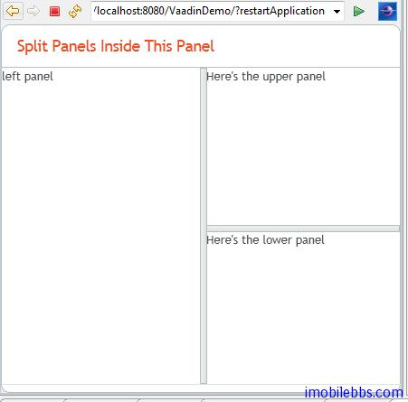

# UI 布局-HorizontalSplitPanel 和 VerticalSplitPanel 布局

HorizontalSplitPanel 和 VerticalSplitPanel 為水平和垂直分割窗口，可以將空間分成上下或左右兩部分。用戶可以通過中間的分隔條調整兩部分的大小。
可以通過 setFirstComponent()和 setFirstComponent()為分隔的兩部分設置不同的 UI 組件， addComponent()也可以依次添加兩個UI組件。

```
// Have a panel to put stuff in
Panel panel = new Panel("Split Panels Inside This Panel");
panel.setSizeFull();
// Have a horizontal split panel as its root layout
HorizontalSplitPanel hsplit = new HorizontalSplitPanel();
panel.setContent(hsplit);
 
// Put a component in the left panel
hsplit.setFirstComponent(new Label("left panel"));
 
// Put a vertical split panel in the right panel
VerticalSplitPanel vsplit = new VerticalSplitPanel();
hsplit.setSecondComponent(vsplit);
 
// Put other components in the right panel
vsplit.addComponent(new Label("Here's the upper panel"));
vsplit.addComponent(new Label("Here's the lower panel"));
mainWindow.setContent(panel);
```



此外可以通過方法 setSplitPosition 設置分隔條的位置，如果不想用戶調整分隔條的位置，可以通過setLocked(true) 禁止用戶移動分隔條。

Tags: [Java EE](http://www.imobilebbs.com/wordpress/archives/tag/java-ee), [Vaadin](http://www.imobilebbs.com/wordpress/archives/tag/vaadin), [Web](http://www.imobilebbs.com/wordpress/archives/tag/web)