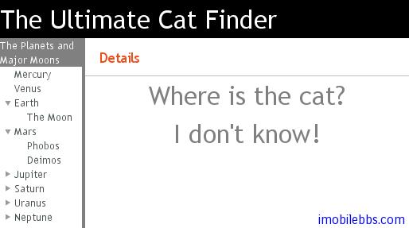

# UI 布局-概述

Vaadin 提供的 UI 组件大体可以分为两类，一类为之前介绍的 UI 组件主要和用户交互。另外一类为布局类，主要目的是用来管理用户界面中所放置的UI组件的大小和位置。
在创建 Window 对象时，如果你不想使用缺省的布局，可以着手创建根布局对象，如下例：

```
// Create the main window.
Window main = new Window("My Application");
setMainWindow(main);
 
// Set the root layout (VerticalLayout is actually the default).
VerticalLayout root = new VerticalLayout();
main.setContent(root);
 
// Add the topmost component.
root.addComponent(new Label("The Ultimate Cat Finder"));
 
// Add a horizontal layout for the bottom part.
HorizontalLayout bottom = new HorizontalLayout();
root.addComponent(bottom);
 
bottom.addComponent(new Tree("Major Planets and Their Moons"));
bottom.addComponent(new Panel());
...
```

在创建好 Layout 对象后，通常还需要对布局对象进行调整，比如大小，对齐方式，间隔等等。
此外布局的使用和用户界面的主题关系密切，比如背景，边界类型，文字对齐等。这些在后面都有详细介绍。
比如使用上面代码创建的一个界面显示如下：



Vaadin 应用创建用户界面除了使用 Java 代码外，Vaadin 提供了 Eclipse IDE 的一个插件，可以通过拖动 UI 组件的方式帮助开发人员设计用户界面。详见后文。

Tags: [Java EE](http://www.imobilebbs.com/wordpress/archives/tag/java-ee), [Vaadin](http://www.imobilebbs.com/wordpress/archives/tag/vaadin), [Web](http://www.imobilebbs.com/wordpress/archives/tag/web)