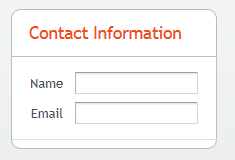
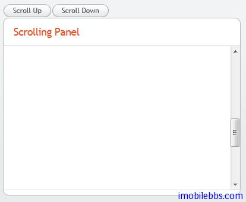

# UI 布局-Panel

Panel 为带有边框和标题的简单容器类，它的客户区为一布局对象，其缺省布局方式为VerticalLayout，可以通过 setContent 来修改缺省布局。
Panel 的标题可以由图标和文字构成。

```
// Create a panel with a caption.
final Panel panel = new Panel("Contact Information");
panel.addStyleName("panelexample");
 
// The width of a Panel is 100% by default, make it
// shrink to fit the contents.
panel.setWidth(Sizeable.SIZE_UNDEFINED, 0);
 
// Create a layout inside the panel
final FormLayout form = new FormLayout();
 
// Have some margin around it.
form.setMargin(true);
 
// Add some components
form.addComponent(new TextField("Name"));
form.addComponent(new TextField("Email"));
 
// Set the layout as the root layout of the panel
panel.setContent(form);
```



对于 Panel 来说，如果其大小为“未定义”，那么它会自动适应其所包含的 UI 组件的大小。但如果它有固定大小而其中所需显示内容过大，则会自动显示滚动条。
如下例在 Panel 中显示一幅图像：

```
// Serve the image from the theme
Resource rsrc = new ThemeResource("img/embedded-journalist.jpg");
        
// Display the image without caption
Embedded image = new Embedded(null, rsrc);
image.setSizeUndefined(); // Actually the default
 
// The panel will give it scrollbars. The root layout
// (VerticalLayout) must have undefined width to make the
// horizontal scroll bar appear.
Panel panel = new Panel("Embedding");
panel.setWidth("400px");
panel.setHeight("300px");
panel.getContent().setSizeUndefined();
panel.addComponent(image);
 
layout.addComponent(panel);
```


Panel 的滚动条也可以使用程序来控制，首先通过 setScrollable(true) 打开滚动条控制，然后使用 setScrollTop()和 setScrollLeft()来控制滚动条的位置。

```
final Panel panel = new Panel("Scrolling Panel");
panel.setHeight("300px");
panel.setWidth("400px");
panel.getContent().setHeight("1000px");
panel.setScrollable(true);
        
layout.addComponent(panel);

HorizontalLayout scrollButtons = new HorizontalLayout();
layout.addComponent(scrollButtons);
        
Button scrollUp = new Button("Scroll Up");
scrollUp.addListener(new Button.ClickListener() {
    public void buttonClick(ClickEvent event) {
        int scrollPos = panel.getScrollTop() - 250;
        if (scrollPos < 0)
            scrollPos = 0;
        panel.setScrollTop(scrollPos);
    }
});
scrollButtons.addComponent(scrollUp);
        
Button scrollDown = new Button("Scroll Down");
scrollDown.addListener(new Button.ClickListener() {
    public void buttonClick(ClickEvent event) {
        int scrollPos = panel.getScrollTop();
        if (scrollPos > 1000)
            scrollPos = 1000;
        panel.setScrollTop(scrollPos + 250);
    }
});
scrollButtons.addComponent(scrollDown);
```



Tags: [Java EE](http://www.imobilebbs.com/wordpress/archives/tag/java-ee), [Vaadin](http://www.imobilebbs.com/wordpress/archives/tag/vaadin), [Web](http://www.imobilebbs.com/wordpress/archives/tag/web)