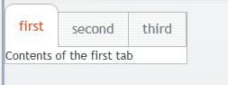

# UI 布局-TabSheet 布局

TabSheet 布局支持標籤顯示。TabSheet 布局通過方法 addTab()添加一個標籤頁。

```
// Create an empty tab sheet.
TabSheet tabsheet = new TabSheet();
 
// Make the tabsheet shrink to fit the contents.
tabsheet.setSizeUndefined();

tabsheet.addTab(new Label("Contents of the first tab")).setCaption("first");
tabsheet.addTab(new Label("Contents of the second tab")).setCaption("second");
tabsheet.addTab(new Label("Contents of the third tab")).setCaption("third");
```



每個標籤頁為一 Tab 對象，可以顯示標題和圖標。

```
tabsheet.addTab(new Label("Contents of the second tab"),
          "Second Tab",
          new ClassResource("images/Venus_small.png", this));
```

用戶點擊標籤時觸發 TabSheet.SelectedTabChangeEvent 事件，獲取當前選中的標籤的方法為getSelectedTab()，同樣將某個標籤設為當前頁為 setSelectedTab()。

Tags: [Java EE](http://www.imobilebbs.com/wordpress/archives/tag/java-ee), [Vaadin](http://www.imobilebbs.com/wordpress/archives/tag/vaadin), [Web](http://www.imobilebbs.com/wordpress/archives/tag/web)