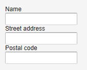
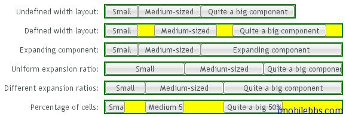

# UI 布局-VerticalLayout 和 HorizontalLayout 布局

VerticalLayout 和 HorizontalLayout 分別垂直和水平安排其中的UI組件。這是 Vaadin 框架中兩個最為重要的布局方式。比如 Window 及其父類 Panel 預設的布局就為 VerticalLayout。
這兩種布局的基本用法如下：

```
VerticalLayout vertical = new VerticalLayout ();
vertical.addComponent(new TextField("Name"));
vertical.addComponent(new TextField("Street address"));
vertical.addComponent(new TextField("Postal code"));
main.addComponent(vertical);
```



改成使用 HorizontalLayout ,顯示如下：


此外可以通過 setSpacing() 來修改 UI 組件之間的空隙，setComponnetAlignment 來修改 UI 組件的對齊方式。
要注意的是，布局中 UI 組件的實際佔據的大小和位置和 UI 組件自身寬度和長度設置的不同有所不同。



比如對於 VerticalLayout 來說，如果其高度使用 Sizeable.SIZE_UNDEFINED 將其設為「未定義」，則其高度自適應其包含的 UI 組件的高度，同理 HorizontalLayout 布局的寬度為「未定義」HorizontalLayout 寬度也取決於其所包含的其她 UI 組件。

註： 如果布局包含的 UI 組件使用了「百分比」來定義高度或寬度，則要求 Layout 必須定義對應的寬度或高度。但如果通過其中包含的某些 UI 組件可以確定布局的寬度或高度，在這種情況下可以不定義布局類的大小
比如：

```
// Vertical layout would normally have 100% width
VerticalLayout vertical = new VerticalLayout();

// Shrink to fit the width of contained components
vertical.setWidth(Sizeable.SIZE_UNDEFINED, 0);

// Label has normally 100% width, but we set it as
// undefined so that it will take only the needed space
Label label =
    new Label("\u2190 The VerticalLayout shrinks to fit "+
              "the width of this Label \u2192");
label.setWidth(Sizeable.SIZE_UNDEFINED, 0);
vertical.addComponent(label);

// Button has undefined width by default
Button butt = new Button("\u2190 This Button takes 100% "+
                         "of the width \u2192");
butt.setWidth("100%");
vertical.addComponent(butt);
```

這個例子使用 VerticalLayout 布局，將其寬度設為「未定義」，而 Button 的寬度設為「100%」，此時如果沒有 Label 組件，則必須為這個 VerticalLayout 指定寬度，否則無法知道這個「100%」是哪個的「100%」。Label 組件的寬度為「未定義」，其寬度取決於其顯示字元的長度，在這個例子中，Button 的寬度設為「100%」，因此與 Label 等寬。


在指定指定布局大小的情況下，預設情況是將其包含的 UI 組件均勻間隔排列。
例如使用 HorizontalLayout，並指定其寬度為400px。

```
HorizontalLayout fittingLayout = new HorizontalLayout();
fittingLayout.setWidth("400px");
fittingLayout.addComponent(new Button("Small"));
fittingLayout.addComponent(new Button("Medium-sized"));
fittingLayout.addComponent(new Button("Quite a big component"));
mainWindow.addComponent(fittingLayout);
```


有些情況下，你可以希望其中某個 UI 組件佔據所有剩餘空間，可以為 UI 組件設置擴展比例（類似於Android 中權重）。擴展比例由方法 Layout 對象 setExpandRatio()指定，第二個參數為擴展的權重。
比如修改上面代碼，不均勻安排三個按鈕，而是讓阿第三個按鈕佔據所剩餘的空間。

```
HorizontalLayout fittingLayout = new HorizontalLayout();
fittingLayout.setWidth("400px");
fittingLayout.addComponent(new Button("Small"));
fittingLayout.addComponent(new Button("Medium-sized"));
// This button will expand.
Button expandButton = new Button("Expanding component");
// Use 100% of the expansion cell's width.
expandButton.setWidth("100%");
// The component must be added to layout before setting the ratio.
fittingLayout.addComponent(expandButton);
// Set the component's cell to expand.
fittingLayout.setExpandRatio(expandButton, 1.0f);
mainWindow.addComponent(fittingLayout);
```


然而，如果 Layout 所包含的 UI 組件沒有定義大小，（如沒有使用如 setWidth(100%))時，擴展比例則是應用到 UI 組件之間的空間。

```
HorizontalLayout layout = new HorizontalLayout();
layout.setWidth("400px");

// Create three equally expanding components.
String[] captions = { "Small", "Medium-sized",
			 "Quite a big component" };
for (int i = 1; i <= 3; i++) {
	Button button = new Button(captions[i-1]);
	layout.addComponent(button);

 // Expand ratios are 1:2:3.
	layout.setExpandRatio(button, i * 1.0f);
}
```


Tags: [Java EE](http://www.imobilebbs.com/wordpress/archives/tag/java-ee), [Vaadin](http://www.imobilebbs.com/wordpress/archives/tag/vaadin), [Web](http://www.imobilebbs.com/wordpress/archives/tag/web)