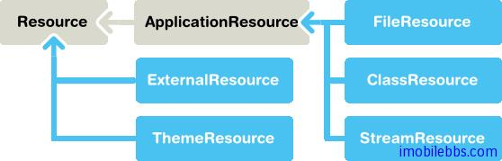
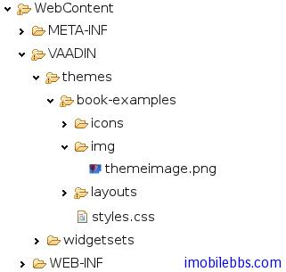

# 使用資源

Web 應用使用多種資源，比如圖像或是供下載的文件。Vaadin 中的Embeded UI 通常顯示圖像而Link提供可供下載的文件，其它的 UI 組件，比如 TabSheet 可以使用圖標資源。

Web 伺服器通常無需 Application 對象的幫助就可以處理對靜態資源的請求，對於一些可以動態生成的資源（圖像，或文件等）Application 則需動態創建這些資源。Vaadin 支持多種資源類型的創建，比如動態創建文件。

下圖為 Vaadin 提供的資源管理的介面類：



Vaadin 提供兩大類資源介面，一為通用的資源 Resource 介面，另外一個為特定的應用程序資源ApplicationResource.

應用程序資源 ApplicationResource 的管理是通過 Application 對象來完成的。當創建該類資源時，Application 對象做為構造函數的參數傳入。構造函數使用 addResource 向 Application 對象註冊該資源。

Application 對象提供 URI 來管理對資源的訪問。URI 的基本格式為 “APP/”+resourceid+”/”+filename,  其中 resourceid 為自動生成的用於唯一指定資源的 ID 號。

文件資源(File Resources)  文件資源指文件系統的文件，一般可以分為兩種，供顯示的圖像和供下載的文件。 可以使用標準的java.io.File  API 來訪問文件。可以使用相對路徑或是絕對路徑來訪問某個文件。

包資源 (Class Loader Resources) 隨打包文件.war 打包的文件中可以包含圖像等資源，此時可以通過 ClassLoader 來訪問這些資源文件。比如下面代碼使用 ClassLoader 來訪問打包文件中的一個圖像資源。

```
mainwindow.addComponent(new Embedded ("",
        new ClassResource("smiley.jpg",
                  mainwindow.getApplication())));
```

主題資源 (Theme Resources) 由類 ThemeResource 管理的主題資源文件，通常為一些圖像文件。Vaadin 的主題在項目中存放在目錄 VAADIN/themes/themename 下。下面代碼片段用來獲取當前主題的一個圖像資源。

```
// A theme resource in the current theme ("book-examples")
// Located in: VAADIN/themes/book-examples/img/themeimage.png
ThemeResource resource = new ThemeResource("img/themeimage.png");

// Use the resource
Embedded image = new Embedded("My Theme Image", resource);
```

對應項目資源目錄如下圖：



關於資源的詳細使用將在後面的文章中介紹。

流資源(Stream Resources)  使用流資源允許應用動態創建資源。比如動態創建圖表。可以通過實現StreamResource.StreamSource 介面來定義一個流資源。這個方法返回一個 InputStream。

下面的例子動態創建一個 PNG 圖像。

```
import java.awt.image.*;

public class MyImageSource
             implements StreamResource.StreamSource {
    ByteArrayOutputStream imagebuffer = null;
    int reloads = 0;

    /* We need to implement this method that returns
     * the resource as a stream. */
    public InputStream getStream () {
        /* Create an image and draw something on it. */
        BufferedImage image = new BufferedImage (200, 200,
                               BufferedImage.TYPE_INT_RGB);
        Graphics drawable = image.getGraphics();
        drawable.setColor(Color.lightGray);
        drawable.fillRect(0,0,200,200);
        drawable.setColor(Color.yellow);
        drawable.fillOval(25,25,150,150);
        drawable.setColor(Color.blue);
        drawable.drawRect(0,0,199,199);
        drawable.setColor(Color.black);
        drawable.drawString("Reloads="+reloads, 75, 100);
        reloads++;

        try {
            /* Write the image to a buffer. */
            imagebuffer = new ByteArrayOutputStream();
            ImageIO.write(image, "png", imagebuffer);

            /* Return a stream from the buffer. */
            return new ByteArrayInputStream(
                         imagebuffer.toByteArray());
        } catch (IOException e) {
            return null;
        }
    }
}
```

使用資源的方法可以多種多樣。某些 UI 組件比如 Embeded,Link 可以直接使用資源作為參數。
下面代碼使用 MyImageSource 作為 Embeded 的圖像資源。

```
// Create an instance of our stream source.
StreamResource.StreamSource imagesource = new MyImageSource ();

// Create a resource that uses the stream source and give it a name.
// The constructor will automatically register the resource in
// the application.
StreamResource imageresource =
        new StreamResource(imagesource, "myimage.png", this);

// Create an embedded component that gets its contents
// from the resource.
main.addComponent(new Embedded("Image title", imageresource));

```

顯示結果如下：


這個資源我們取名為 myimage.png ,Application 對象為其添加一個資源ID使得資源標識唯一。 此時可以通過 http://localhost:8080/testbench/APP/1/myimage.png 來訪問這個圖像。 其中 APP/1/myimage.png 為資源的相對路徑，可以通過方法 Application.getRelativeLocation()來取得資源的相對路徑。

Tags: [Java EE](http://www.imobilebbs.com/wordpress/archives/tag/java-ee), [Vaadin](http://www.imobilebbs.com/wordpress/archives/tag/vaadin), [Web](http://www.imobilebbs.com/wordpress/archives/tag/web)