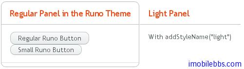
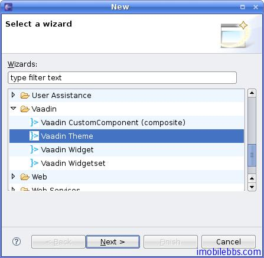

# 使用主题-创建和应用新主题

Vaadin 中创建的主题必须放置在 VAADIN/themes 目录下。目录名称即为新的主题名称，新主题中必须包含一个 styles.css 文件。新主题也必须继承某个 Vaadin 内置主题，如：

@import "../reindeer/styles.css";

.v-app {
    background: yellow;
}
前面介绍的 Vaadin 个 UI 组件和布局都可以通过 CSS 修改它们的显示外观。它们都定义了对应的Vaadin 的 CSS 类名，下表给出了 Vaadin 中标准 UI 组件的 CSS 类名：
```
Server-Side Component	Client-Side Widget	CSS Class Name
AbsoluteLayout	VAbsoluteLayout	v-absolutelayout
Accordion	VAccordion	v-accordion
Button	VButton	v-button
CheckBox	VCheckBox	v-checkbox
CssLayout	VCssLayout	v-csslayout
CustomComponent	VCustomComponent	v-customcomponent
CustomLayout	VCustomLayout	v-customlayout
DateField	VDateField	v-datefield
VCalendar	v-datefield-entrycalendar
VDateFieldCalendar	v-datefield-calendar
VPopupCalendar	v-datefield-calendar
VTextualDate	
Embedded	VEmbedded	–
Form	VForm	v-form
FormLayout	VFormLayout	–
GridLayout	VGridLayout	–
Label	VLabel	v-label
Link	VLink	v-link
OptionGroup	VOptionGroup	v-select-optiongroup
HorizontalLayout	VHorizontalLayout	v-horizontallayout
VerticalLayout	VVerticalLayout	v-verticallayout
Panel	VPanel	v-panel
Select		
VListSelect	v-listselect
VFilterSelect	v-filterselect
Slider	VSlider	v-slider
SplitPanel	VSplitPanel	–
VSplitPanelHorizontal	–
VSplitPanelVertical	–
Table	VScrollTable	v-table
VTablePaging	v-table
TabSheet	VTabSheet	v-tabsheet
TextField	VTextField	v-textfield
VTextArea	
VPasswordField	
Tree	VTree	v-tree
TwinColSelect	VTwinColSelect	v-select-twincol
Upload	VUpload	–
Window	VWindow	v-window
–	CalendarEntry	–
–	CalendarPanel	v-datefield-calendarpanel
–	ContextMenu	v-contextmenu
–	VUnknownComponent	vaadin-unknown
–	VView	–
–	Menubar	gwt-MenuBar
–	MenuItem	gwt-MenuItem
–	Time	v-datefield-time
```

Vaadin 内置了两种主题，reindeer 和  runo, Vaadin 6.0 缺省使用 reindeer 主题。 有关主题定义的常数定义在包 com.vaadin.ui.themes 中。

```
setTheme("runo");

Panel panel = new Panel("Regular Panel in the Runo Theme");
panel.addComponent(new Button("Regular Runo Button"));

// A button with the "small" style
Button smallButton = new Button("Small Runo Button");
smallButton.addStyleName(Runo.BUTTON_SMALL);

Panel lightPanel = new Panel("Light Panel");
lightPanel.addStyleName(Runo.PANEL_LIGHT);
lightPanel.addComponent(new Label("With addStyleName(\"light\")"));
```



Vaadin 的 Eclipse 插件可以帮助创建新主题，为项目添加一个新主题. New -> Other -> Vaadin -> Vaadin theme



按照向导一步一步，就可以创建一个新的主题，然后修改新主题下的 styles.css ，就可以达到自己预期的显示效果。

Tags: [Java EE](http://www.imobilebbs.com/wordpress/archives/tag/java-ee), [Vaadin](http://www.imobilebbs.com/wordpress/archives/tag/vaadin), [Web](http://www.imobilebbs.com/wordpress/archives/tag/web)