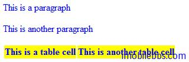
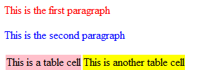
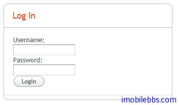
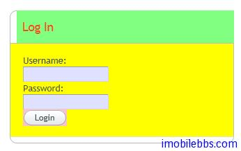

# 使用主题-CSS简介

Vaadin主题的使用一个重要的方法是使用CSS风格文件。本篇对CSS的使用做个简单的介绍。

## 基本CSS规则

一个CSS文件包含一组规则，每个规则包含一个“风格选择符”，由逗号分开。然后通过花括号将风格描述括在里面。例如：

```
p, td {
 color: blue;
}

td {
 background: yellow;
 font-weight: bold;
}
```

上例中p,td 匹配到HTML中的<p> 和<td> 元素，第一个规则可以匹配所有<p> 和<td> 元素，第二个规则只匹配<td>元素。
你可以使用浏览器来显示下面的Html文档：

<html>
```
    <head>
        <link rel="stylesheet" type="text/css"
              href="mystylesheet.css"/>
    </head>
    <body>
        <p>This is a paragraph</p>
		<p>This is another paragraph</p>
		<table>
            <tr>
                <td>This is a table cell</td>
				<td>This is another table cell</td>
			</tr>
        </table>
    </body>
</html>
```

其中的mystylesheet.css 则包含上面的CSS规则。使用Chrome浏览器显示如下：



CSS 也支持继承机制，也就是说子元素可以从其父元素中继承CSS属性。比如可以从
元素继承。

```
table {
 color: blue;
 background: yellow;
}
```

匹配元素类
CSS 直接使用元素类型,如上面的<p>,<td>定义规则的情况并不多见，常见的是使用元素的类名来匹配规则。比如下面的HTML文档，使用class 来为元素定义类名。

```
<html>
  <body>
    <p class="normal">This is the first paragraph</p>
	<p class="another">This is the second paragraph</p>
	<table>
      <tr>
        <td class="normal">This is a table cell</td>
		<td class="another">This is another table cell</td>
	 </tr>
    </table>
 </body>
</html>
```

然后使用类名匹配来定义CSS规则

```
p.normal   {color: red;}
p.another  {color: blue;}
td.normal  {background: pink;}
td.another {background: yellow;}
```



CSS 匹配支持使用通配符，如* 来匹配任意元素类型。 × 也可以省略，而只用 “.”.如：

```
.normal {
    color: red;
}

.another {
    blackground: yellow;
}
```

Vaadin 建议只使用类名匹配来定义规则而不要使用HTML 元素名称来定义规则以提高Web应用的兼容性。

## 包含关系匹配

CSS支持根据HTML元素之间的包含关系来匹配规则，比如：

```
<body>
  <p class="mytext">Here is some text inside a
                    paragraph element</p>
 <table class="mytable">
    <tr>
      <td class="mytext">Here is text inside
                      a table and inside a td element.</td>
    </tr>
 </table>
</body>
```

规则 .mytext 会同时匹配

和 元素，但如果我们只想匹配表格中的td 元素，可以通过 table 类名做为 前缀来定义规则，如下：

```
.mytable .mytext {color: blue;}
```

其中类前缀并不需要为其子元素的直接父容器的类名，只要它们之间存在包含关系即可。 比如 .v-panel . v-button 可以匹配所有包含着 .v-panel 中的 v-button 元素。

下面来看看一个Vaadin的实例。
定义一个Vaadin自定义组件（登录界面）

```
public class LoginBox extends CustomComponent {
    Panel         panel  = new Panel("Log In");

    public LoginBox () {
        setCompositionRoot(panel);
        
        panel.addComponent(new TextField("Username:"));
        panel.addComponent(new TextField("Password:"));
        panel.addComponent(new Button("Login"));
    }
}
```

使用内置的runo 主题显示如下：



可以查到 Panel, TextField, Button 等对应的Vaadin CSS类名分别为恶 v-panel, v-textfield, v-button, 通过自定义风格，修改其style.css 定义如下CSS 规则：

```
.v-panel .v-panel-caption {
 background: #80ff80; /* pale green */
}
 
.v-panel .v-panel-content {
 background: yellow;
}
 
.v-panel .v-textfield {
 background: #e0e0ff; /* pale blue */
}
 
.v-panel .v-button {
 background: pink;
}
```

显示如下：



Tags: [Java EE](http://www.imobilebbs.com/wordpress/archives/tag/java-ee), [Vaadin](http://www.imobilebbs.com/wordpress/archives/tag/vaadin), [Web](http://www.imobilebbs.com/wordpress/archives/tag/web)


