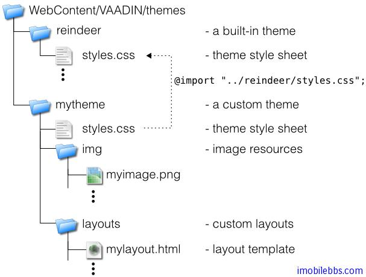

# 使用主题-概述

在前面介绍 Vaadin 的 UI 组件及布局时，特地没有介绍这些UI组件对应的 CSS 设置，而是留在这里介绍 Vaadin 主题时一并说明。
Vaadin 应用可以通过主题（Theme）来修改界面的外观，用户主题包括 Css 文件，自定义的 HTML 布局及使用的图像等。主题资源(Theme Resource)可以通过 ThemeResource 类访问 。

用户自定义的主题必须放置在目录 WebContent/VAADIN/themes/ 下，这个目录名是固定的。
下图显示了 Vaadin 主题的目录的一般结构：



主题的名称由其目录名称指定，比如上面定义了两个主题，一个是 reindeer (Vaadin 内置），另外一个为 mytheme. 每个主题必须包含一个 styles.css 文件。其它的主题资源可以自由命名。但一般的命名习惯为使用 img 目录存放图像文件，layouts 存放自定义 HTML 布局，css 存放 CSS 文件。

使用主题的方法非常简单，调用 setTheme 方法，如下例：

```
public class MyApplication
       extends com.vaadin.Application {
    public void init() {
        setTheme("mytheme");
        ...
    }
}
```

Vaadin 支持 Web 应用根据不同情况（如不同的用户登录）使用不同的主题。

Tags: [Java EE](http://www.imobilebbs.com/wordpress/archives/tag/java-ee), [Vaadin](http://www.imobilebbs.com/wordpress/archives/tag/vaadin), [Web](http://www.imobilebbs.com/wordpress/archives/tag/web)