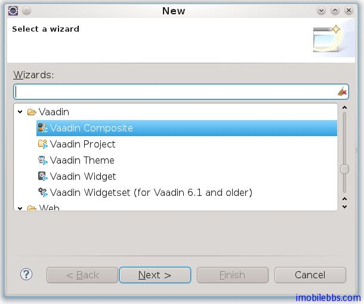
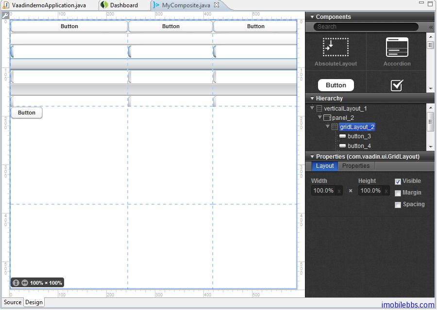

# 可視化界面編輯插件

前面基本介紹了 Vaadin 提供的各種 UI 組件和布局，所以界面都是通過代碼來完成的。安裝 Vaadin的 Eclipse 插件後，可以通過拖拉的方式來開始話設計用戶界面。設計出的界面為 CustomComponent 的派生類。使用 CustomComponent 的基本方法如下：並可以參見[ Vaadin Web 應用開發教程(27):UI組件-自定義組件](http://www.imobilebbs.com/wordpress/?m=20120813)

```
public class MyApplication extends Application {
    public void init() {
        Window mainWindow = new Window("My Application");
        setMainWindow(mainWindow);

        // Needed because composites are full size
        mainWindow.getContent().setSizeFull();

        MyComposite myComposite = new MyComposite();
        mainWindow.addComponent(myComposite);
    }
}
```

使用可視化編輯器是提供 Eclipse Vaadin 插件創建 Vaadin Composite : Vaadin->Vaadin Composite



通過嚮導創建的 UI 界面預設使用的是 AbsoluteLayout，其預設大小為100%。
可視化界面編輯具有兩個標籤頁:Source 和 Design，分別對應代碼和設計器。



如果你使用過其它界面設計工具，如 Visual Studio 等，也就比較容易使用 Vaadin 的界面編輯器來設計 UI 界面，這裡就不詳述了。

由可視化界面編輯設計出的界面對應的代碼含義特定的結構，對於那些含有@AutoGenerated 標註的部分不要手工修改。

Tags: [Java EE](http://www.imobilebbs.com/wordpress/archives/tag/java-ee), [Vaadin](http://www.imobilebbs.com/wordpress/archives/tag/vaadin), [Web](http://www.imobilebbs.com/wordpress/archives/tag/web)